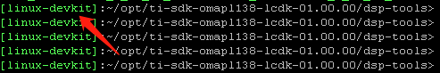
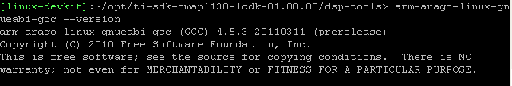
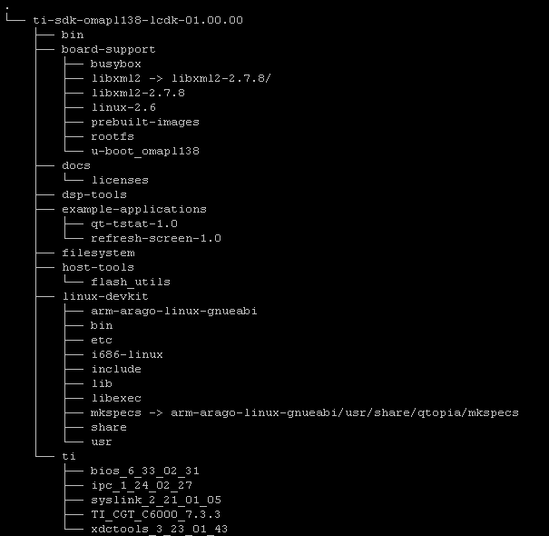
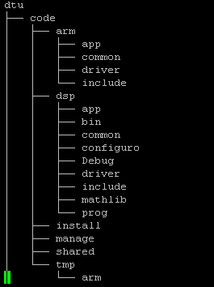
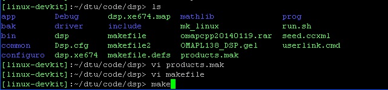

# 建立omap开发环境

1. 安装Linux操作系统；  
	本次开发安装的是Ubuntu16.04 安装好后,假设用户目录为/home/user.
2. 建立开发环境所在目录；   
	cd ~   
	mkdir opt
3. 拷贝开发包  
	cp ti-sdk-omapl138-lcdk-01.00.00.bz2 ~/opt  
	cp ... ~/opt 
4. 解压开发包   
	cd opt   
	tar -jxvf ti-sdk-omapl138-lcdk-01.00.00.bz2   
	此时,在opt目录下将有 ti-sdk-omapl138-lcdk-01.00.00目录
5. 添加路径变量   
	cd ~   
	vi .bashrc  
	在这个文件中,添加这样一句话:   
	export TI_SDK_PATH= ~/opt/ti-sdk-omapl138-lcdk-01.00.00/  
	然后source ~/.bashrc
6. 建立开发环境   
	- 建立omap_env文件   
		vi omap_env  
		输入下面一段话：  
		source ~/opt/ti-sdk-omapl138-lcdk-01.00.00/linux-devkit/environment-setup   
		然后,执行source omap_env 此时,提示符变为:   
		  
		 输入下面一段话: arm-arago-linux-gnueabi-gcc --version,将出现如下内容:   
		   
		表示安装成功.
	- 安装dsp部分程序  
		cd ~/opt/ti-sdk-omapl138-lcdk-01.00.00/dsp-tools/   
		逐个执行相应文件:  
		./bios_setuplinux_6_33_02_31.bin  
		./ipc_setuplinux_1_24_02_27.bin  
		./ti_cgt_c6000_7.3.3_setup_linux_x86.bin  
		./xdctools_setuplinux_3_23_01_43.bin  
		syslink_2_10_03_20.tar.gz文件不要解开,将被更高版本替代.  
		注意安装的时候最好修改路径都放在opt目录下,   
		   
		cp ~/opt/syslink_2_21_01_05.tar.gz ti   
		cd ti  
		tar zxvf syslink_2_21_01_05.tar.gz  
		cd ..  
		安装完后  
		mv ti ~/opt/ti-sdk-omapl138-lcdk-01.00.00/board-support/ 
		将ti的dsp部分工具移到board-support目录下.
	- 安装arm部分程序  
		- 安装libxml2  
			cd ~/opt  
			tar zxvf libxml2_2.7.8.dfsg.orig.tar.gz -C ~/opt/ti-sdk-omapl138-lcdk-01.00.00/board-support   
			ln ~/opt/ti-sdk-omapl138-lcdk-01.00.00/board-support/libxml2-2.7.8/ ~/opt/ti-sdk-omapl138-lcdk-01.00.00/board-support/libxml2 -s    
		- 安装u-boot
			tar jxvf ~/opt/u-boot_omapl138.tar.gz2 -C ~/opt/ti-sdk-omapl138-lcdk-01.00.00/board-support/ 
		- 安装Linux内核
			unzip ~/opt/linux-2.6.zip -d ~/opt/ti-sdk-omapl138-lcdk-01.00.00/board-support
		- 安装rootfs
			tar zxvf ~/opt/filesystem.tar.gz -C ~/opt/ti-sdk-omapl138-lcdk-01.00.00/board-support/   
			cd ~/opt/ti-sdk-omapl138-lcdk-01.00.00/board-support/rootfs/ 
			sudo tar zxvf rootfs_omapl138.tar.gz  

	安装完以上文件后,opt目录应当如下:  
	
7. 编译应用程序
	将应用程序拷贝到合适位置,其目录结构为:  
	  
	进入arm目录,编辑makefile文件,将其中的xxx替换成用户的目录  
	   
	执行make命令   
	  
	结果文件为arm    
	进入dsp目录,编辑product.mak文件,将其中的xxx替换成用户的目录  
	  
	执行make命令   
	  
	结果文件为dsp.xe674
8. 编译系统程序
	- linux系统  
		cd ~/opt/ti-sdk-omapl138-lcdk-01.00.00/board-support/linux-2.6/   
		./build_sh   
		结果文件为uImage_omapl138
	- u-boot  
		cd ~/opt/ti-sdk-omapl138-lcdk-01.00.00/board-support/u-boot_omapl138/   
		./build.sh   
		结果文件为:u-boot-head.bin
	- rootfs  
		cd ~/opt/ti-sdk-omapl138-lcdk-01.00.00/board-support/rootfs/   
		./rootfs.sh  
		结果文件为rootfs_omapl138 

