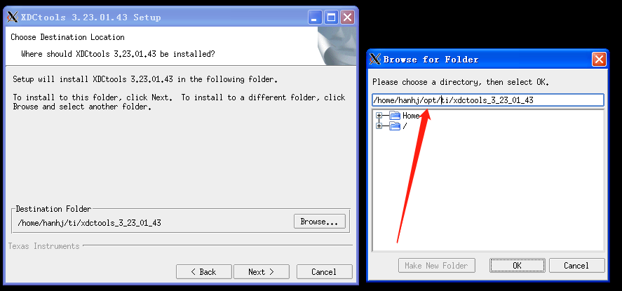
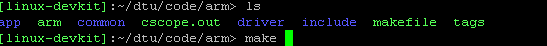

# 建立omap开发环境

1. 安装Linux操作系统；  
	本次开发安装的是Ubuntu16.04 安装好后,假设用户目录为/home/user.
2. 建立开发环境所在目录；   
	cd ~   
	mkdir opt
3. 拷贝开发包  
	cp ti-sdk-omapl138-lcdk-01.00.00.bz2 ~/opt
4. 解压开发包   
	cd opt   
	tar -jxvf ti-sdk-omapl138-lcdk-01.00.00.bz2   
	此时,在opt目录下将有 ti-sdk-omapl138-lcdk-01.00.00目录
5. 添加路径变量   
	cd ~   
	vi .bashrc  
	在这个文件中,添加这样一句话:   
	export TI_SDK_PATH= ~/opt/ti-sdk-omapl138-lcdk-01.00.00/  
	然后source ~/.bashrc
6. 建立开发环境   
	- 建立omap_env文件   
		vi omap_env  
		输入下面一段话：  
		source ~/opt/ti-sdk-omapl138-lcdk-01.00.00/linux-devkit/environment-setup   
		然后,执行source omap_env 此时,提示符变为:   
		  
		 输入下面一段话: arm-arago-linux-gnueabi-gcc --version,将出现如下内容:   
		   
		表示安装成功.
	- 安装dsp部分程序  
		cd ~/opt/ti-sdk-omapl138-lcdk-01.00.00/dsp-tools/   
		逐个执行相应文件:  
		./bios_setuplinux_6_33_02_31.bin  
		./ipc_setuplinux_1_24_02_27.bin  
		./ti_cgt_c6000_7.3.3_setup_linux_x86.bin  
		./xdctools_setuplinux_3_23_01_43.bin  
		syslink_2_10_03_20.tar.gz文件不要解开,将被更高版本替代.  
		注意安装的时候最好修改路径都放在opt目录下,   
		   
		cp ~/opt/syslink_2_21_01_05.tar.gz ti   
		cd ti  
		tar zxvf syslink_2_21_01_05.tar.gz  
		cd ..  
		安装完后  
		mv ti ~/opt/ti-sdk-omapl138-lcdk-01.00.00/board-support/ 
		将ti的dsp部分工具移到board-support目录下.
	- 安装arm部分程序  
		- 安装libxml2  
			cd ~/opt  
			cp libxml2_2.7.8.dfsg.orig.tar.gz ~/opt/ti-sdk-omapl138-lcdk-01.00.00/board-support   
			cd ~/opt/ti-sdk-omapl138-lcdk-01.00.00/board-support/  
			tar jxvf libxml2_2.7.8.dfsg.orig.tar.gz   
			ln libxml2_2.7.8 libxml -s    
7. 编译应用程序
	将应用程序拷贝到合适位置,其目录结构为:  
	  
	进入arm目录,编辑makefile文件,将其中的xxx替换成用户的目录  
	  
	执行make命令   
	  
	进入dsp目录,编辑product.mak文件,将其中的xxx替换成用户的目录  
	  
	执行make命令   
	
	
8. 编译系统程序
	- linux系统  
		cp ~/dtu/board/board_src/linux-2.6/ ~/opt/ti-sdk-omapl138-lcdk-01.00.00/board-support/ -r  
		cd ~/opt/ti-sdk-omapl138-lcdk-01.00.00/board-support/linux-2.6/   
		./build_sh   
		结果文件为uImage_omapl138
	- u-boot  
		cp ~/dtu/board/board_src/u-boot_omapl138/ ~/opt/ti-sdk-omapl138-lcdk-01.00.00/board-support/ -r   
		cd ~/opt/ti-sdk-omapl138-lcdk-01.00.00/board-support/u-boot_omapl138/   
		./build.sh   
		结果文件为:u-boot-head.bin
	- rootfs  
		cp ~/dtu/board/board_src/filesystem/ ~/opt/ti-sdk-omapl138-lcdk-01.00.00/board-support/filesystem -r  
		cd ~/opt/ti-sdk-omapl138-lcdk-01.00.00/board-support/filesystem/   
		./rootfs.sh  
		结果文件为rootfs_omapl138 

