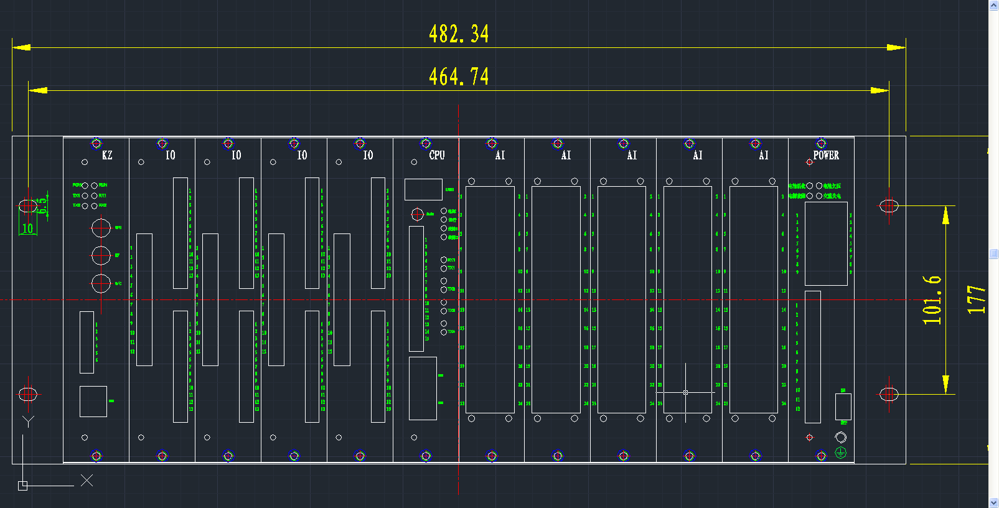
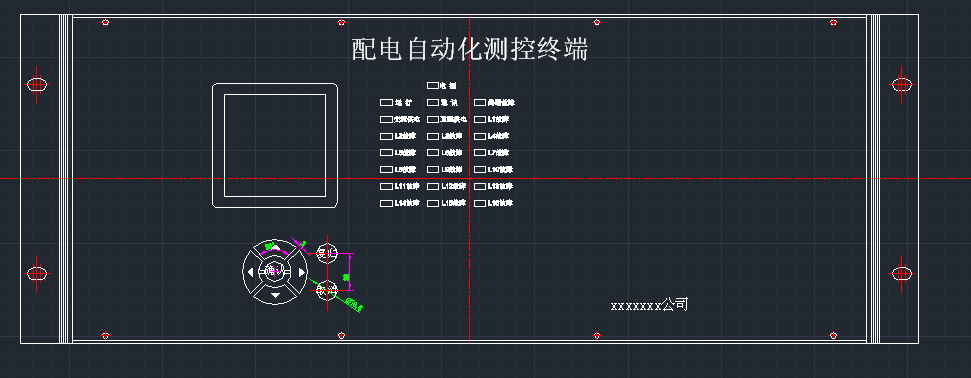
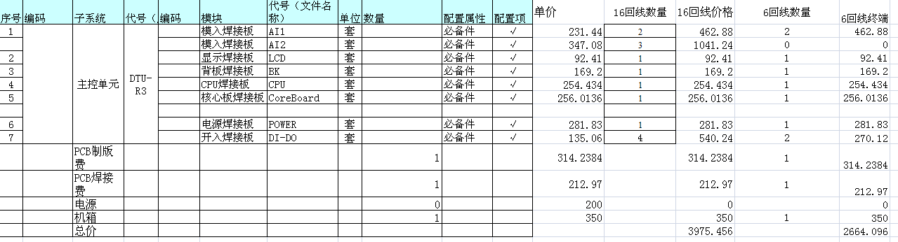

# 关于基于OMAPL138平台的DTU设计方案的说明

1. 总体设计:  
	总体按十六回设计，4U高，19英寸宽，12块插板，其中包括1块电源板，1块CpU板，5块AI板，4块I0板，1块扩展板。
2. AI板1:
	每块板可采1回电压，3回电流。包括4个电压,9个电流。
3. AI板2：
	每块板可采4回电流。包括12个电流。
4. IO板：
	IO板用于遥信信号输入，控制信号输出。每块IO板有4回YX，YK。每回有6个YX，2个YK，总共有24个YX，8个YK。
5. CPU板：
	标配是有二个网口，四个串口，1个USB口。指示灯包括运行等、线路故障指示灯、终端故障灯、通讯指示灯、手动复归线路故障按键。
6. 电源板：
	24V输入，24V输出。4个公共YX，4个公共YK，2路直流。	提供电源管理功能（5个电源状态YX，3个电源控制YK）。
7。 液晶板（可选）：
	采用160*160单色液晶，7个按键（上下左右确认、取消、复归），LED指示灯22个（包括电源指示,运行灯,分回线线路故障指示灯,终端故障指示灯,通讯指示灯,交流供电指示灯,直流供电指示灯）,通讯接口为串口。
8. 扩展板：
	支持GPRS、GPS、短距离无线，2路串口。
9. 平台选择：
	CPU选择TI公司的OMAPL138平台，该cpu包括Arm926ej和C674两个核，其中Arm核运行于Linux操作系统，C674Dsp核运行Sysbios系统。二个内核之间通过syslink进行通信。
10. 总线：
	采用数字总线技术，子板和cpu板之间通过数字总线通信。	
	

	
	

	
	

