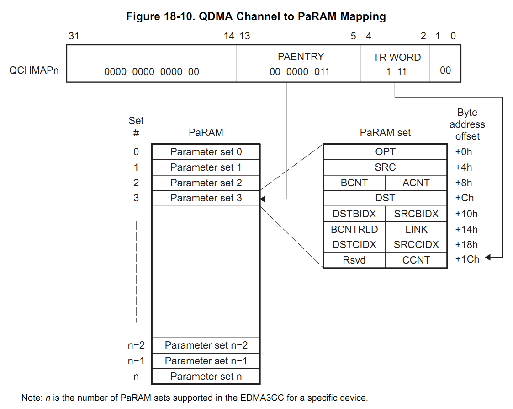
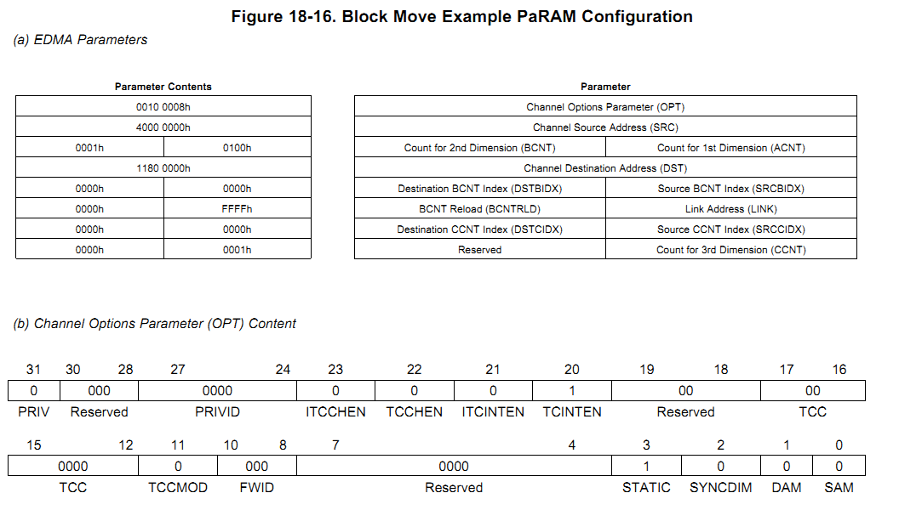

# EDMA3 使用

## 1. 简介
edma3是一个加强的直接内存传输控制器,其用于控制两个设备的内存之间传输数据,包括但不限于以下应用:

- 软件内存传输(比如外部存储器和内部存储器)
- 用于外设,比如串口;
- 从CPU下载数据.

EDMA3包括两个控制器,一个是通道控制(channel control),包括内存配置,通道控制寄存器,中断控制寄存器.一个是传输控制器(transfer control),负责数据移动.数据传输由EDMA3CC发起,由EDMA3TC负责读写命令.

EDMA3有两个CC控制器,其中CC0有两个TC控制器,CC1有1个TC控制器.

## 2. 结构和通用操作.

总体结构:

### 2.1 传输方式
edma的每次传输的都是定义的一个三维数组.

如图所示:

- 第一维是ArrayN,即每个Array包括ACNT个bytes的数据;
- 第二维是Array1,Array2...ArrayBCNT,即每个Frame,包括BCNT个Array;
- 第三维是Frame0,Frame1,...Frame CCNT, 包括CCNT个Frame

传输方式有2种:

- 称为A同步方式,即每次传输一个Array(ACNT个字节)即结束.

	
- 称为AB同步方式,即每次传输一个Frame(ACNT*BCNT个字节)即结束.

	

### 2.2 PaRam Set

一个控制传输的结构化内存指令集.

每一个指令集:每一一行是一个32位数(4 byte),共8行.

在OmapL138中有128个Set.

指令集对每次传输进行描述,包括选项,源地址,目标地址,ACNT,BCNT,CCNT等.

SRC 是一个32bit的地址,表示源地址

DST 是一个32bit的地址,表示目标地址

ACNT 16bit,表示每个Array中包括的Byte数

BCNT:16bit,表示每个Frame中包括的Array数.

CCNT:16bit,表示多少个Frame 

BCNTRLD 表示每次BCNT减为0时,需要重新加载的BCNT

BIDX表示每次传输完一个Array所要增加的地址偏移量,
	
CIDX表示传输完一个Frame所要增加的地址偏移量.

Link:表示一个链接地址,每当完成一次(三维数据)传输,可以从该地址加载下一次传输的Frame set

Null PaRAM set:当ACNT,BCNT,CCNT都设成0,表示该set是一个空Set,当传输控制器(CC)
遇到一个Null Set时,将会产生错误,并停止传输.

Dummy PaRAM set:当ACNT,BCNT,CCNT中至少有一个为0是,而至少有一个不为0的set.当CC遇到一个Dummy set时,不会产生错误,只不过传输了0 bytes.

**A模式和AB模式下寄存器的Set更新情况.**

**使用Link寄存器的传输情况**

**使用Link寄存器,链接到自身的传输情况**

### 2.4 启动传输

启动一个DMA传输,可以有三种方式:

- 事件触发
- 手动触发
- 链式触发

启动一个QDMA传输,可以有两种方式:

- 自动触发:当PaRam中设置了triggered
- 链式触发:当PaRAM中Link被设置了.

### 2.4.1 事件触发

### 2.4.2 手动触发

### 2.4.3 链式触发

链式触发是在当一次传输完毕,根据配置CC自动装载另一个PaRAM以继续完成数据传输.

### 2.5 完成传输

当期望的TR(Transfer Request)传输完成之后,控制器会发出完成标志.

期望的TR有两种:1. 完全传输,传输完所有TR;2完全传输前,仅剩最后一个TR.

对于A和AB模式其TR数如下:

A 模式

- 完全传输,传输 b*c CNT TRs
- 完全传输前,BCNT ==1 && CCNT==1

AB 模式

- 完全传输,传输 CCNT TRs
- 完全传输前, CCNT==1

该模式设置在OPT.TCCMODE中:
0 Normal Mode
1 Early Mode

此外,对于每个TR完成,也可配置发送完成标志,对于A模式每次传输一个Array就会发送一个标志;对于AB模式,每次传输完一个Frame,就会发送一个标志.这种配置方式称为内部完成标志(InterComplete).

通过OPT中的TCINTEN,ITCINTEN可以进行设置

TCINTEN =1,ITCINTEN=0,非内部模式, 仅最后一个TR时中断  
TCINTEN =0,ITCINTEN=1,内部模式, 每个TR时中断  
TCINTEN =1,ITCINTEN=1, 所有,包括最后最后一个TR时中断  

## 2.6 事件,通道,PaRAM的映射关系

### 2.6.1事件和DMA通道

对于事件驱动的DMA,其事件与通道是固定关系的.当用户的这个通道没有相应的事件,该通道可以使用手动触发或链式触发,或使用QDMA通道.

### 2.6.2 DMA通道和PaRAM

### 2.6.3 QDMA通道和PaRAM

QDMA和PaRAM的映射关系是可编程的.

通过QCHMAPn寄存器来配置QDMAn与PaRAM的映射关系

默认的,QDMA0 映射到PaRAM0...	

## 2.7 EDMA3通道控制寄存器 

包括:

- 全局寄存器
	包括CCCFG,例如Chamap_exist,num_regn(num of shadow regions)
	QCHMAPn ...
- Error Register
- Region Access Eanble Register
- Status visibility Register
- DMA channel Register(ER,ESR,CER,EECR,SER...)
- Interrupt Register
- QDMA Channel Register (QER,QEER...)
	
## 2.8 链式DMA通道 

链式dma通道在一次DMA传输完毕后,可启动另外一个通道的dma传输.与Link模式拷贝另外一个PaRAM到其中所不同的是,该模式并不改变自身set.

通过opt中的TCCHEN,ITCCHEN可以设置链式DMA的完成标志设置.(类似于DMA通道)

	
## 2.9 中断 

EDMA3的中断包括

- 完成中断
- 错误中断

### 2.9.1 完成中断 

当完成中断时,会置位IPR(Interrupt Peding Requester),通道置位哪个IPR可以通过OPT中TCC(Transmit Complete Code)来配置.比如当TCC置位为0时,则该channel完成时将置位IPR[0].

#### 2.9.1.1 允许完成中断 

中断相关寄存器:

- IER	Interrupt Enable
- IECR	Interrupt Enable clear
- IESR	Interrupt Enable set
- IPR	Interrupt pending 
- ICR	Interrupt pending clear 

中断产生:

EDMA3CC_INT0:	 
	PR.E0 & IER.E0 & DRAE0.E0 ;  
	PR.E1 & IER.E1 & DRAE0.E1 ;  
	...

EDMA3CC_INT1:	 
	PR.E0 & IER.E0 & DRAE1.E0 ;  
	PR.E1 & IER.E1 & DRAE1.E1 ;  
	...

DARE0:Dma Region Enable 0  
DARE1:Dma Region Enable 1  
DARE2:Dma Region Enable 2  
DARE3:Dma Region Enable 3  
...

#### 2.9.1.2 中断服务程序

1. read IPR
2. Proform operions needed
3. wirte ICR
4. Read IPR again  
	if IPR <>0 perform 2 repeat  
	if IPR ==0 enable all interrupts 

## 2.10	Event Queues

Event Queue用来缓存事件,长度最多为16.

队列是一个FIFO队列

有两个queue,其中Q0优先级>Q1优先级 

## 2.12 流程图

## 2.13 优先级

有几种优先级:

- 通道优先级:0 通道优先级最高,31 通道优先级最低
- 触发事件优先级:对于同一个通道,ER > CER > ESR
- 出列优先级:对于有两个Queue的队列,Q0>Q1
- 控制器优先级

## 2.14 CC和TC的优化 

## 2.15 EDMA3时钟

在OMAPL138中使用PLL0分配的sysclk2时钟,如果采用默认值(24M晶振)为150M.

## 2.16 复位状态.
复位时,硬件会复位CC,TC寄存器,但是PaRAM处于未定义转台,用户必须初始化PaRAM,如果想用它的话.

## 2.17 电源管理

EDMA3可以通过PSC(device Power and Sleep Controller)使其处于低功耗状态,以减少功耗.

在EDMA3进入低功耗状态前,需要按照下面的步骤进行检查:

- 没有等待的DMA/QDMA事件
- 没有外部的事件在事件队列中.
- TR传输过程不在进行中
- 没有完成请求处理
- 没有总线请求处理

前4个状态可以用CCSTAT(Channel Controller Status)寄存器来获得.

通常建议禁止CC TC 然后再进入低功耗模式.

进一步,先禁止相关外设,再禁止EDMA3.

## 2.18 仿真

在仿真状态下,cpu可以被挂起,在挂起的状态下EDMA3的控制是持续的,事件依然可以被执行和传输.

EDMA3是为多主机服务的,所以不能单独对某个主机进行调试.

## 3. 使用的例子

一个内存拷贝的例子

## 4. EDMA3寄存器

### 4.1 PaRAM 

**opt**

- STATIC 设置PaRAM是否允许更新,  
	0 允许,1 不允许.  
	当采用Link模式传输时,需要将其置位0,否则将其置位1.
- DAM	:destination address Mode  
	0 Increse mode   
	1 constant Mode   
- SAM	:source address mode  
	0 Increse mode   
	1 constant Mode   

