# Sys/Bios使用

## 1 简介
sysbios是一个抢占式多任务,硬件抽象,实时分析和配置的工具软件.  

### 1.1 特性:  
1. 支持硬件,软件中断,任务,idle函数,周期性函数.  
2. 支持线程间通信包括:信号量,邮箱,事件,gates和可变长度的消息.  
3. 一个底层的中断分发操作函数.  
4. 支持允许/禁止中断和调整中断.  

### 1.2 TI_RTOS和Sys/bios的关系
sysbios是TI_RTOS的内核部分,完整的TI_RTOS还包括:TI_RTOS Instrumentation,TI_RTOS NetWorking,TI_RTOS File System,TI_RTOS USB,TI_RTOS Drivers and Board Initialization

### 1.3 sysbios和XDCtools的关系
XDCtools是一个TI-RTOS底层的工具,用来配置sysbios,创建配置文件和改变sysbios的内存,系统控制等.  

xdc和sysbios通过包的形式提供函数服务.其关系如下: 

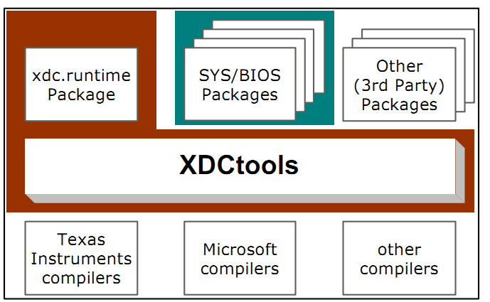
	
使用xdc 配置sysbios  

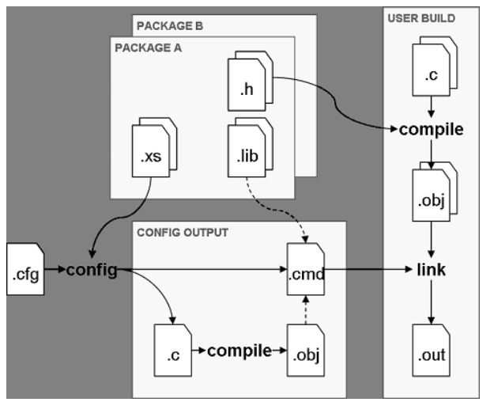

配置文件cfg可以用可视的方式在ccs中编辑,也可以用文本编辑工具产生.

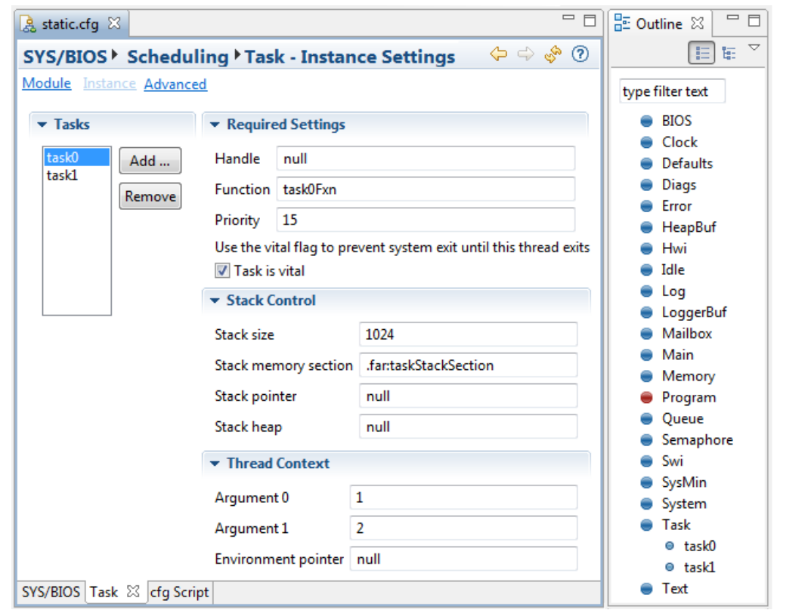
ccs中创建一个task0任务

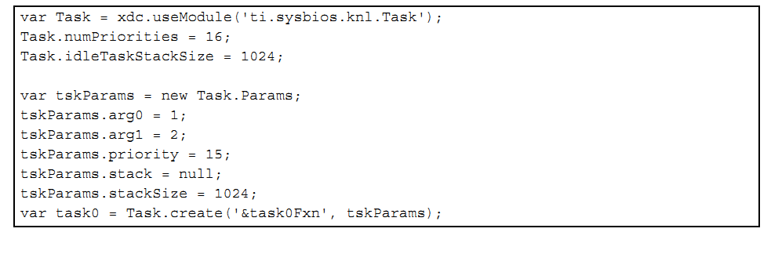
使用文本方式创建一个task0任务

#### xdc.rumtime包
xdc的rumtime包提供以下模块

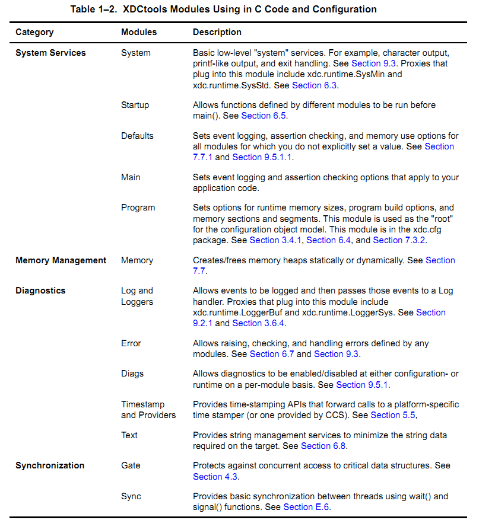

### 1.4 Sys/Bios的包
sysbios包括以下的包

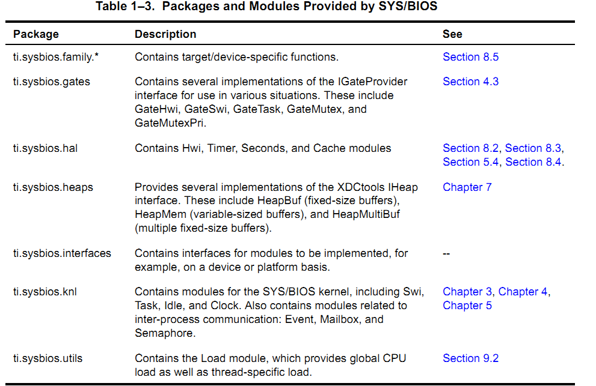

为了在程序中使用这些包,需要包括其头文件

	#include <xdc/std.h> //init XDCtools
	#include <ti/sysbios/BIOS.h> //init sys/bios 
	#include <ti/sysbios/knl/Task.h>	//init Task Module

这些头文件的路径在ccs的工程配置中指示(默认在安装ccs时已经配置好了)

### 1.4.1 创建sysbios实体
创建sysbios实体有三种方式:xx_create,xx_construct,静态在cfg文件中创建

1. 使用xx_create()方式  
一般的步骤: 
	1. 声明参数  
	2. 初始化参数,并配置参数  
	3. 调用create函数  

	例如:

		创建一个Semaphore
		#include <ti/sysbios/knl/Semaphore.h>
		Semaphore_Handle sema_handle;
		Semaphore_Params sema_para;
		Error_Block eb;
		...
		Error_init(&eb);
		Semaphore_Params_init(&sema_para);
		sema_para.mode=Semaphore_Mode_BINARY;
		...
		sema_handle=Semaphore_create(0,&sema_para,&eb);

2. 使用xx_construct方式   

		例如:创建一个Semaphore
		#include <ti/sysbios/knl/Semaphore.h>
		Semaphore_Struct my_sem_stu;
		Semaphore_Params sema_para;
		...
		Semaphore_Params_init(&sema_para);
		sema_para.mode=Semaphore_Mode_BINARY;
		...
		Semaphore_construct(&my_sem_stu,0,&sema_para);
		...
		Semaphore_post(Semaphore_handle(&my_sem_stu));//post a samaphore
使用consturct方式不像create方式,在heap中分配内存,可减少代码量,而且为了方便也没有使用Error_Block.
3. 使用静态cfg方式

		例如:
		var sema_para=new Semaphore.Params();
		Program.global.sema_handle=Semaphore.create(0,sema_para);
使用静态方式,同样不需要使用Heap,一个结构体生成代码将在根据配置文件所创建的源文件中出现.  
静态创建实体不能被动态的销毁.

#### 1.4.2 可移植的线程支持
sysbios支持可移植的标准thread接口函数,支持包括线程,互斥量(mutexs),读写锁(read/write locks),分界(barriers),条件变量(condition variables)

### 1.5 在C++中使用sysbios
1. 支持new,delete方式内存使用  
2. 使用extern "C" 来支持c++调用
3. 在配置文件使用类成员函数
配置文件中不能直接使用类,所以可以用c函数来包装类,例如:

		void clockPrd(Clock clock){
			clock.tick();
			return ;
		}
4. 构造函数
	构造函数.析构函数将在类构造和销毁的时候调用,在sysbios中需要注意这一点.比如对于Memory_alloc函数不能在中断中调用,所以特定的类不要在中断中使用内存分配函数.

### 1.6 帮助Help
在ccs中默认安装了sysbiosAPI帮助,可以在Help中找到

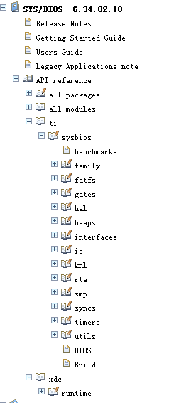
其他一些帮助文档:

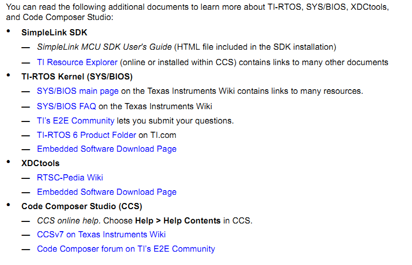

## 2. 创建和配置一个sysbios项目
### 2.1 快速的方法是通过Help->Welcome to ccs 来创建  

### 2.2 配置sysbios
整体查看使用模块情况:双击项目中的.cfg文件

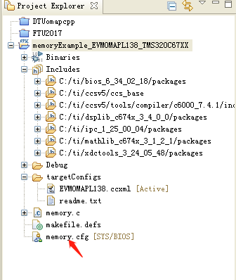

然后

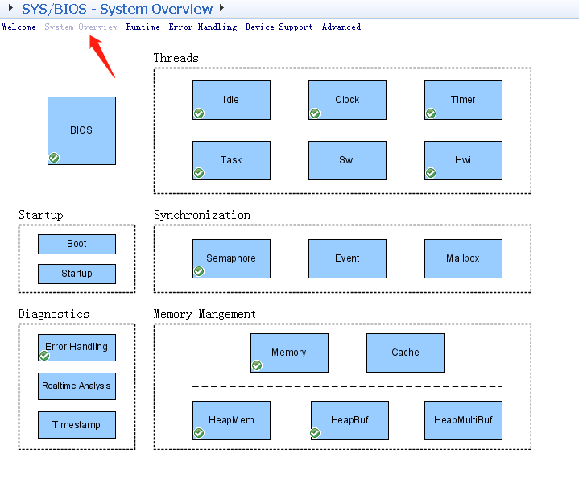

添加或删除模块:可以用outline或者Available窗口

outline窗口:从Windows->show view->outline进入

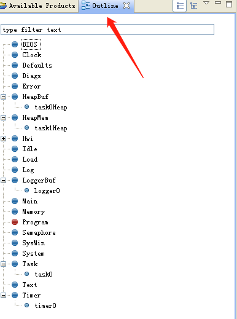

然后在相应的模块中点击右键disable或者new

或者从Available Product窗口:从Window->show view->Availablea Product进入

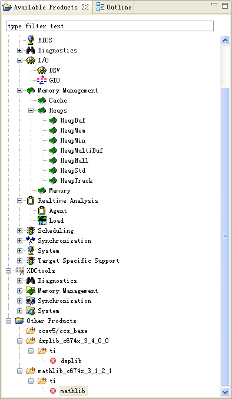

然后在相应的模块中点击右键disable或者new
	
## 3. 线程模块
### 3.1 sysbios启动过程:  
1. reset:call c_init00
2. prior cinit :call user Reset.fxns[] hook
3. cinit 
4. call user first function :Startup.firstFxns[]
5. all module init 
6. call user last function:Startup.lastFxns[]
7. pinit
8. main 

### 3.2 sysbios的线程overview
### 3.2.1 线程类型
1. Hwi:HardWare Interrupt
硬件中断被硬件触发,具有最高优先级,一旦启动其将被完成除非被抢占了.
2. Swi:Software Interrupt
软件中断比硬件中断优先级低,它也是一旦启动就会被完成,除非被抢占.不像硬件中断,软件中断可以被软件所触发.
3. Task 
任务比Idle高优先级,相比软件中断,task可以被阻塞.
4. Idle 
Idle具有最低优先级.

#### 3.2.2 如何选择线程
1. hwi用于要有最小低至5us的最后期限的任务.
2. swi用于最后期限大约在100us或更高的任务
3. task被用于复杂的任务,与swi相比,task可以被阻塞.
4. idle被用于当没有任务执行时的操作,可被用于减少功耗的场合.
5. clock被用于周期性任务,可以是一次,也可以是重复的.所有的clock具有相同的优先级,所以它不能用来抢占其他clock.它使用swi来实现的,它是可被抢占的.
6. timer是使用硬件定时器来完成的,所以其继承了硬件的优先级.其以定时器的周期被调用,timer线程应当仅仅执行必须的操作,如果有更复杂的任务应当考虑post一个swi来完成以有效管理cpu的时间.

#### 3.2.3 线程优先级

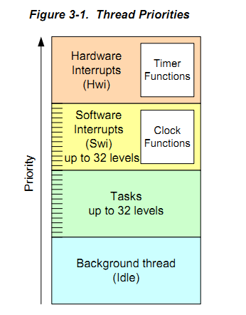

任务的抢占情况

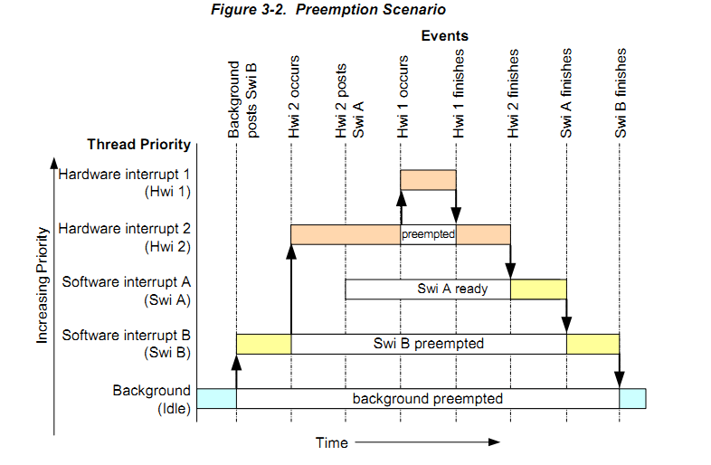

#### 3.2.4 Hook 
为了灵活性,对于Hwi,Swi,Task,sysbios提供了Hook接口用于这些任务的不同时期的钩子函数包括register,create,begin,end,delete

### 3.3 SMP
sysbios支持平衡多处理器系统,比如dual-core ARM Cortex-M3,M4,ARM cortex-A15.

### 3.4 Hwi
#### 3.4.1 create objct
创建一个Hwi的步骤与创建sysbios实体的步骤一致.

	void hwi_fun(UArg arg0,UArg arg1){
		return;
	}
	#include <ti/sysbios/hal/Hwi.h>
	Hwi_Params hwi_para;
	Hwi_Handle hwi_handle;
	
	id=50;//interrupt id
	Hwi_Params_init(&hwi_para);
	hwi_handle=Hwi_create(id,hwi_fun,&hwi_para,NULL);

说明:

- 当在ISR被执行前,Hwi被多次触发将只执行一次.
- 中断可以中Hwi_enable()来禁止

#### 3.4.2 Hook fun 
1. Register Fun   
void registerFxn(int id);
2. Create and Delete fun   
void createFxn(Hwi_Handle hwi,Error_Block *eb);  
void deleteFxn(Hwi_Handle hwi);  
3. Begin and End fun   
void beginFxn(Hwi_Handle hwi);  
void endFxn(Hwi_Handle hwi);  

use Hook 

	in C routine
	void my_register(int id){
	}
	void my_create(Hwi_Handle hwi,Error_Block *eb){
	}
	....
	In config 
	var Hwi = xdc.useModule('ti.sysbios.haw.Hwi');
	Hwi.addHookSet({
			registerFxn:'&my_register',
			createFxn:'&my_create',
			beginFxn:'&my_begin',
			endFxn:'&my_end',
	});

### 3.5 Swi  
#### 3.5.1 概述
Swi软中断类似于Hwi硬中断.软中断被程序触发,例如Swi_post().软中断的优先级低于硬中断而高于Task.(注意:不要将Swi与处理器的软指令弄混了,swi这里指的是机器相关的软中断).

软中断适合用于低速或者与Hwi相比不需要非常实时的场合.

sysbios中触发软中断的API有:  

- Swi_andn(Swi_Handle handle,uint mask)  
将Triger与mask相与,clear 相应位,只有当triger为0时post  
- Swi_dec(Swi_Handle)  
将Triger--,只有当triger为0时post.   
- Swi_inc(Swi_Handle)    
Triger++,and post  
- Swi_or(Swi_Handle,mask)     
Triger or mask and post  
- Swi_post(Swi_Handle )   
Not change Triger, post  

#### 3.5.2 创建swi 

创建一个Swi的步骤与创建sysbios实体的步骤一致.

	void swi_fun(UArg arg0,UArg arg1){
		return;
	}
	#include <ti/sysbios/knl/Swi.h>
	Swi_Params swi_para;
	Swi_Handle swi_handle;
	Error_Block eb;
	
	Error_init(&eb);
	Swi_Params_init(&hwi_para);
	swi_handle=Swi_create(hwi_fun,&swi_para,&eb);

#### 3.5.3 swi执行	
当一个swi被post,swi manager将其放入一个swis posted队列中,manager将检查当前运行状态,当满足运行条件(优先级)时,将执行该swi,执行完manager将其移出队列.当在manager将其移出队列之前,如果有多次被post,则只执行一次.

1. 当swi被移出队列时,其triger将被清零.但是如果在其在队列时,没有被执行,通过Swi_getTrigger()可以返回当前trigger计数.

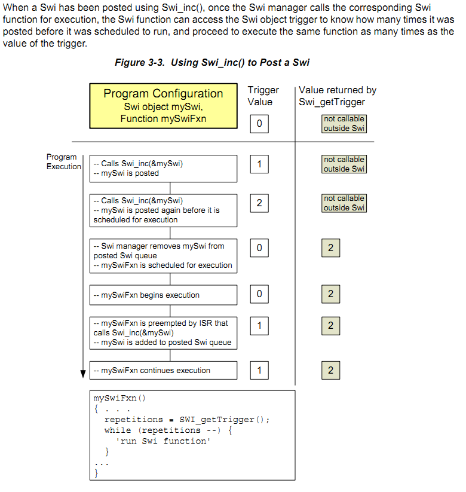

2. 使用Swi_andn:需要多个事件同时发生

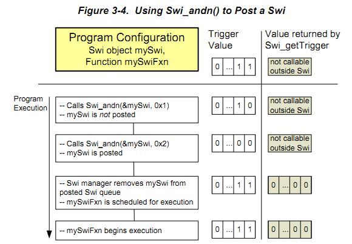

3. 使用swi_dec:同一个事件需要多次发生

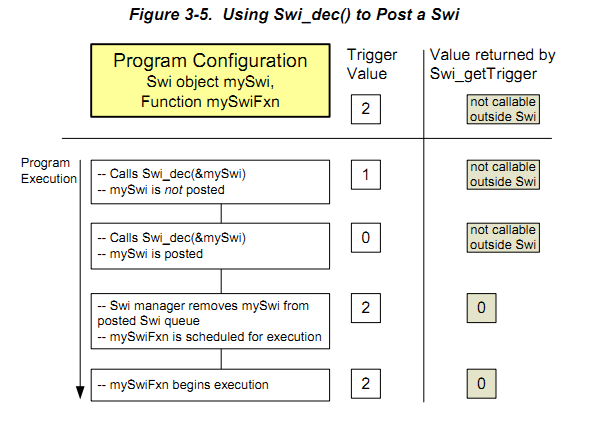

4. 使用swi_or:多个事件需要发生

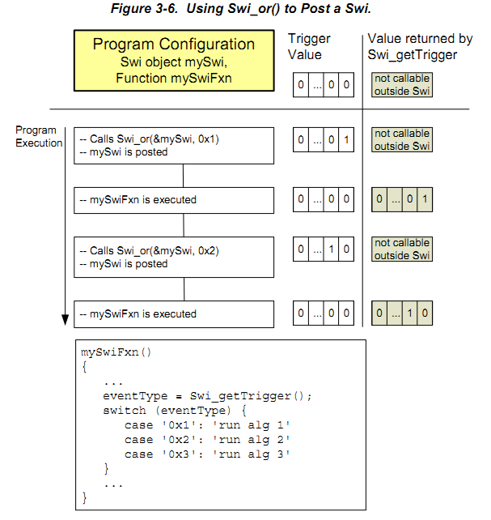

#### 3.5.4 几点重要说明:  
1. swi优先级低于hwi,当一个swi被触发,将在所有hwi执行完后才被执行.另外一方面,swi优先级高于task,swi可以抢夺task的控制权.所有等待的swi将被优先执行,当task将要被执行的时候.
2. 可以设置swi的优先级,最多有32级.
3. swi和hwi使用系统堆栈,默认的堆栈长度为4096,可以在config文件中用Program.stack=xxxx来设置.task使用私有堆栈.
4. 一旦swi被执行,它将被完成(除非被其他高优先级抢占),其不能被阻塞.
5. 触发swi的来源包括:hwi,clock,idle或者其他swi.
6. 通常将长的isr程序分成两部分,hwi做实时性较强的工作,然后通过swi完成实时性不强的工作,从而提高系统性能.
7. 可以通过swi_disable/restore来禁止swi调度,以实现共享内存操作等,而相同的任务如果用hwi来做,则可能会降低系统性能.

#### 3.5.5 hook
与Hwi的Hook类似

### 3.6 Task 
#### 3.6.1 概述 
Task的优先级低于Hwi,Swi高于Idle.

创建一个Task的步骤与一般Sysbios实体的步骤一致.

	#include <ti/sysbios/knl/Task.h>
	Task_Params task_para;
	Task_Handle task_handle;
	Error_Block eb;

	Error_init(&eb);
	Task_Params_init(&task_para);
	task_para.stackSzie=512;
	task_para.priority=15;
	task_handle=Task_create(fun_task,&task_para,&eb);

#### 3.6.2 Tash的运行状态
包括:RUNNING,READY,BLOCKED,TERMINATED,INACTIVE

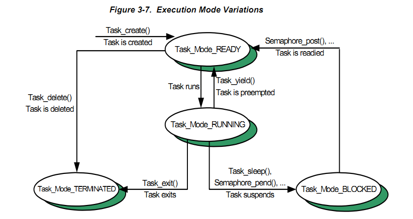

#### 3.6.3 Task Stacks 
Task具有私有的堆栈,可以通过创建Task是指定Task大小.

系统要求的堆栈大小

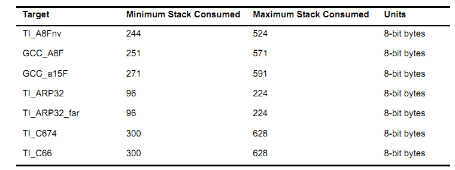

为了防止堆栈越界,可以使用Task_stat来检测当前堆栈使用情况.

	Task_Stat task_sta;
	Task_stat(Task_self(),&task_sta);
	if(task_sta.used>(task_sta.stackSize*9/10)){
		printf("over 90% is used\r\n");
	}
#### 3.6.4 Hook 
Hook与hwi,swi的Hook 类似

### 3.7 Idle 
Idle loop 是在没有hwi,swi,task执行的时候被调用的.可以有多个Idle,其优先级都是一样的,执行顺序是依次执行.

如果不想创建一个thread idle,可以使用下面的代码:

	Task.enableIdleTask=false;
	Task.allBlockedFunc=Idle.run;

idle将在task处于pend状态的时候被调用.

## 4. 同步模块
sysbios的同步模块包括:Semaphores,Event,Gate,Mailbox,Queue

### 4.1 Semaphore  
1. create Semaphore 
	
		#include <ti/sysbios/knl/Semaphore.h>
		Semaphore_Handle sema_handle;
		Semaphore_Params sema_para;
		Error_Block eb;
		...
		Error_init(&eb);
		Semaphore_Params_init(&sema_para);
		sema_para.mode=Semaphore_Mode_BINARY;
		...
		int init_value=0;
		sema_handle=Semaphore_create(init_value,&sema_para,&eb);
2. post,pend

		Semaphore_post(sema_handle);
		Semaphore_pend(sema_handle,timeout);

### 4.2 Event
Event与samaphore类似,但是Event允许多个事件.

1. create

		#include <ti/sysbios/knl/Event.h>
		Event_Handle event_handle;
		Event_Params event_para;
		Error_Block eb;
	
		Error_init(&eb);
		Event_Params_init(&event_para);
		Event_create(&event_para,&eb);
2. post pend

		Event_post(event_handle,uint envnt_mask);
		Event_pend(event_handle,uint and_mask,uint or_mask,uint timeout);

### 4.3 Mailbox 
Mailbox用来在同一个处理器的不同Task之间传递消息.

1. create 

		#include <ti/sysbios/knl/Mailbox.h>
		Mailbox_Handle mailbox_handle;
		Mailbox_Params mailbox_para;
		Error_Block eb;
	
		Error_init(&eb);
		Mailbox_Params_init(&mailbox_para);
		mailbox_handle=Mailbox_create(Size_t size_of_block,int number_block,&mailbox_para,&eb);
2. post pend

		/*
		 put message into mailbox slot .if current mailbox slot is full,will block.
		until timeout.timeout can use BIOS_NO_WAIT,BIOS_WAIT_FOREVER.
		system will get message from mailbox to first pend task.
		return 1 if data has be copied ,or 0
		*/
		Mailbox_post(mailbox_handle,Ptr message,uint timeout);

		/*
		wait message from mailbox,if data is avilable by post ,task will copy data from mailbox to message.
		*/
		Mailbox_pend(mailbox_handle,Ptr message,uint timeout);
		
	
### 4.4 Queue 
Queue用来传输一组信息,是一个双向队列

1. create 

		#include <ti/sysbios/knl/Queue.h>
		Queue_Handle queue_handle;
		Queue_Params queue_para;
		Error_Block eb;
	
		Error_init(&eb);
		Queue_Params_init(&queue_para);
		quque_handle=Queue_create(&mailbox_para,&eb);
2. enque,dequeu,get,put,head,next,

		void Queue_enqueue(Queue_Handle ,Queue_Elem*elem);
		Ptr Queue_dequeue(Queue_Handle);
		enque 在队尾入列,dequeue从队头出列,二者不能保证数据操作原子性.

		void Queue_put(Queue_Handle,Queue_Elem *elem);
		Ptr Queue_get(Queue_Handle);
		采用禁止中断的方式保证原子性.

		typedef _stu{
			Queue_Elem elem;
			int data;
		}stu;
		stu *rp;
		stu d1,d2;
		d1.data=1;
		d2.data=2;
		queue=Queue_create(NULL,NULL);
		Queue_enqueue(queue,&d1.elem);
		Queue_enqueue(queue,&d2.elem);

		while(!Queue_empty(queue)){
			rp=Queue_dequeue(queue);
			...
		}
		/*
		 Iterate Element
		 */
		Queue_Elem*p;
		for(p=Queue_head(queue);p!=(Queue_Elem*)queue;p=Queue_next(p)){
			...
		}

## 5. Timing 服务

## 6. 支持模块

## 7. 内存模块

## 8. 硬件抽象模块HAL

## 9. 测试模块

## A. 构建SysBios

## B. Timing Benchmarks

## C. Size Benchmarks

## D. 最小化应用代码

## E. 反对的I/O 模块

## F. IOM 接口

	

