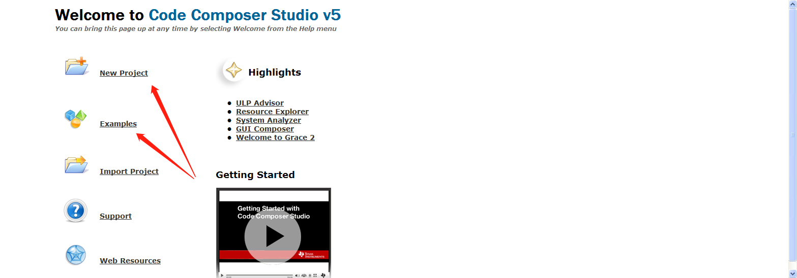

# Sys/Bios使用

## 1 简介
sysbios是一个抢占式多任务,硬件抽象,实时分析和配置的工具软件.  

### 1.1 特性:  
1. 支持硬件,软件中断,任务,idle函数,周期性函数.  
2. 支持线程间通信包括:信号量,邮箱,事件,gates和可变长度的消息.  
3. 一个底层的中断分发操作函数.  
4. 支持允许/禁止中断和调整中断.  

### 1.2 TI_RTOS和Sys/bios的关系
sysbios是TI_RTOS的内核部分,完整的TI_RTOS还包括:TI_RTOS Instrumentation,TI_RTOS NetWorking,TI_RTOS File System,TI_RTOS USB,TI_RTOS Drivers and Board Initialization

### 1.3 sysbios和XDCtools的关系
XDCtools是一个TI-RTOS底层的工具,用来配置sysbios,创建配置文件和改变sysbios的内存,系统控制等.  

xdc和sysbios通过包的形式提供函数服务.其关系如下: 

	
使用xdc 配置sysbios  

配置文件cfg可以用可视的方式在ccs中编辑,也可以用文本编辑工具产生.

ccs中创建一个task0任务

使用文本方式创建一个task0任务

#### xdc.rumtime包
xdc的rumtime包提供以下模块

### 1.4 Sys/Bios的包
sysbios包括以下的包

为了在程序中使用这些包,需要包括其头文件

	#include <xdc/std.h> //init XDCtools
	#include <ti/sysbios/BIOS.h> //init sys/bios 
	#include <ti/sysbios/knl/Task.h>	//init Task Module

这些头文件的路径在ccs的工程配置中指示(默认在安装ccs时已经配置好了)

### 1.4.1 创建sysbios实体
创建sysbios实体有三种方式:xx_create,xx_construct,静态在cfg文件中创建

1. 使用xx_create()方式  
一般的步骤: 
	1. 声明参数  
	2. 初始化参数,并配置参数  
	3. 调用create函数  

	例如:

		创建一个Semaphore
		#include <ti/sysbios/knl/Semaphore.h>
		Semaphore_Handle sema_handle;
		Semaphore_Params sema_para;
		Error_Block eb;
		...
		Error_init(&eb);
		Semaphore_Params_init(&sema_para);
		sema_para.mode=Semaphore_Mode_BINARY;
		...
		sema_handle=Semaphore_create(0,&sema_para,&eb);

2. 使用xx_construct方式   

		例如:创建一个Semaphore
		#include <ti/sysbios/knl/Semaphore.h>
		Semaphore_Struct my_sem_stu;
		Semaphore_Params sema_para;
		...
		Semaphore_Params_init(&sema_para);
		sema_para.mode=Semaphore_Mode_BINARY;
		...
		Semaphore_construct(&my_sem_stu,0,&sema_para);
		...
		Semaphore_post(Semaphore_handle(&my_sem_stu));//post a samaphore
使用consturct方式不像create方式,在heap中分配内存,可减少代码量,而且为了方便也没有使用Error_Block.
3. 使用静态cfg方式

		例如:
		var sema_para=new Semaphore.Params();
		Program.global.sema_handle=Semaphore.create(0,sema_para);
使用静态方式,同样不需要使用Heap,一个结构体生成代码将在根据配置文件所创建的源文件中出现.  
静态创建实体不能被动态的销毁.

#### 1.4.2 可移植的线程支持
sysbios支持可移植的标准thread接口函数,支持包括线程,互斥量(mutexs),读写锁(read/write locks),分界(barriers),条件变量(condition variables)

### 1.5 在C++中使用sysbios
1. 支持new,delete方式内存使用  
2. 使用extern "C" 来支持c++调用
3. 在配置文件使用类成员函数
配置文件中不能直接使用类,所以可以用c函数来包装类,例如:

		void clockPrd(Clock clock){
			clock.tick();
			return ;
		}
4. 构造函数
	构造函数.析构函数将在类构造和销毁的时候调用,在sysbios中需要注意这一点.比如对于Memory_alloc函数不能在中断中调用,所以特定的类不要在中断中使用内存分配函数.

### 1.6 帮助Help
在ccs中默认安装了sysbiosAPI帮助,可以在Help中找到

其他一些帮助文档:

## 2. 创建和配置一个sysbios项目
### 2.1 快速的方法是通过Help->Welcome to ccs 来创建  

### 2.2 配置sysbios
整体查看使用模块情况:双击项目中的.cfg文件

然后

添加或删除模块:可以用outline或者Available窗口

outline窗口:从Windows->show view->outline进入

然后在相应的模块中点击右键disable或者new

或者从Available Product窗口:从Window->show view->Availablea Product进入

然后在相应的模块中点击右键disable或者new
	
## 3. 线程模块
### 3.1 sysbios启动过程:  
1. reset:call c_init00
2. prior cinit :call user Reset.fxns[] hook
3. cinit 
4. call user first function :Startup.firstFxns[]
5. all module init 
6. call user last function:Startup.lastFxns[]
7. pinit
8. main 

### 3.2 sysbios的线程overview
### 3.2.1 线程类型
1. Hwi:HardWare Interrupt
硬件中断被硬件触发,具有最高优先级,一旦启动其将被完成除非被抢占了.
2. Swi:Software Interrupt
软件中断比硬件中断优先级低,它也是一旦启动就会被完成,除非被抢占.不像硬件中断,软件中断可以被软件所触发.
3. Task 
任务比Idle高优先级,相比软件中断,task可以被阻塞.
4. Idle 
Idle具有最低优先级.

#### 3.2.2 如何选择线程
1. hwi用于要有最小低至5us的最后期限的任务.
2. swi用于最后期限大约在100us或更高的任务
3. task被用于复杂的任务,与swi相比,task可以被阻塞.
4. idle被用于当没有任务执行时的操作,可被用于减少功耗的场合.
5. clock被用于周期性任务,可以是一次,也可以是重复的.所有的clock具有相同的优先级,所以它不能用来抢占其他clock.它使用swi来实现的,它是可被抢占的.
6. timer是使用硬件定时器来完成的,所以其继承了硬件的优先级.其以定时器的周期被调用,timer线程应当仅仅执行必须的操作,如果有更复杂的任务应当考虑post一个swi来完成以有效管理cpu的时间.

#### 3.2.3 线程优先级

任务的抢占情况

#### 3.2.4 Hook 
为了灵活性,对于Hwi,Swi,Task,sysbios提供了Hook接口用于这些任务的不同时期的钩子函数包括register,create,begin,end,delete

### 3.3 SMP
sysbios支持平衡多处理器系统,比如dual-core ARM Cortex-M3,M4,ARM cortex-A15.

### 3.4 Hwi
#### 3.4.1 create objct
创建一个Hwi的步骤与创建sysbios实体的步骤一致.

	void hwi_fun(UArg arg0,UArg arg1){
		return;
	}
	#include <ti/sysbios/hal/Hwi.h>
	Hwi_Params hwi_para;
	Hwi_Handle hwi_handle;
	
	id=50;//interrupt id
	Hwi_Params_init(&hwi_para);
	hwi_handle=Hwi_create(id,hwi_fun,&hwi_para,NULL);

说明:

- 当在ISR被执行前,Hwi被多次触发将只执行一次.
- 中断可以中Hwi_enable()来禁止

#### 3.4.2 Hook fun 
1. Register Fun   
void registerFxn(int id);
2. Create and Delete fun   
void createFxn(Hwi_Handle hwi,Error_Block *eb);  
void deleteFxn(Hwi_Handle hwi);  
3. Begin and End fun   
void beginFxn(Hwi_Handle hwi);  
void endFxn(Hwi_Handle hwi);  

use Hook 

	in C routine
	void my_register(int id){
	}
	void my_create(Hwi_Handle hwi,Error_Block *eb){
	}
	....
	In config 
	var Hwi = xdc.useModule('ti.sysbios.haw.Hwi');
	Hwi.addHookSet({
			registerFxn:'&my_register',
			createFxn:'&my_create',
			beginFxn:'&my_begin',
			endFxn:'&my_end',
	});

### 3.5 Swi  
#### 3.5.1 概述
Swi软中断类似于Hwi硬中断.软中断被程序触发,例如Swi_post().软中断的优先级低于硬中断而高于Task.(注意:不要将Swi与处理器的软指令弄混了,swi这里指的是机器相关的软中断).

软中断适合用于低速或者与Hwi相比不需要非常实时的场合.

sysbios中触发软中断的API有:  

- Swi_andn(Swi_Handle handle,uint mask)  
	用于需要满足多个条件的触发.  
	将TrigerValue与mask相与,clear 相应位,只有当triger为0时post    
	比如开始时将TriggerValue配置成3  
	只有调用Swi_andn(&swi,0x1),Swi_andn(&swi,0x2)后才能post
- Swi_dec(Swi_Handle)  
	将TrigerValue--,只有当triger为0时post.    
- Swi_inc(Swi_Handle)    
	Triger++,and post    
	在swi中可以通过Swi_getTrigger获得在执行前有多少个post.  
	多个post只执行一次
- Swi_or(Swi_Handle,mask)     
	用于只需要满足一个条件就可以触发的情况  
	Triger or mask and post  
- Swi_post(Swi_Handle )   
	Not change Triger, post  

#### 3.5.2 创建swi 

创建一个Swi的步骤与创建sysbios实体的步骤一致.

	void swi_fun(UArg arg0,UArg arg1){
		return;
	}
	#include <ti/sysbios/knl/Swi.h>
	Swi_Params swi_para;
	Swi_Handle swi_handle;
	Error_Block eb;
	
	Error_init(&eb);
	Swi_Params_init(&hwi_para);
	swi_handle=Swi_create(hwi_fun,&swi_para,&eb);

#### 3.5.3 swi执行	
当一个swi被post,swi manager将其放入一个swis posted队列中,manager将检查当前运行状态,当满足运行条件(优先级)时,将执行该swi,执行完manager将其移出队列.当在manager将其移出队列之前,如果有多次被post,则只执行一次.

1. 当swi被移出队列时,其triger将被清零.但是如果在其在队列时,没有被执行,通过Swi_getTrigger()可以返回当前trigger计数.

2. 使用Swi_andn:需要多个事件同时发生

3. 使用swi_dec:同一个事件需要多次发生

4. 使用swi_or:多个事件需要发生

#### 3.5.4 几点重要说明:  
1. swi优先级低于hwi,当一个swi被触发,将在所有hwi执行完后才被执行.另外一方面,swi优先级高于task,swi可以抢夺task的控制权.所有等待的swi将被优先执行,当task将要被执行的时候.
2. 可以设置swi的优先级,最多有32级.
3. swi和hwi使用系统堆栈,默认的堆栈长度为4096,可以在config文件中用Program.stack=xxxx来设置.task使用私有堆栈.
4. 一旦swi被执行,它将被完成(除非被其他高优先级抢占),其不能被阻塞.
5. 触发swi的来源包括:hwi,clock,idle或者其他swi.
6. 通常将长的isr程序分成两部分,hwi做实时性较强的工作,然后通过swi完成实时性不强的工作,从而提高系统性能.
7. 可以通过swi_disable/restore来禁止swi调度,以实现共享内存操作等,而相同的任务如果用hwi来做,则可能会降低系统性能.

#### 3.5.5 hook
与Hwi的Hook类似

### 3.6 Task 
#### 3.6.1 概述 
Task的优先级低于Hwi,Swi高于Idle.

创建一个Task的步骤与一般Sysbios实体的步骤一致.

	#include <ti/sysbios/knl/Task.h>
	Task_Params task_para;
	Task_Handle task_handle;
	Error_Block eb;

	Error_init(&eb);
	Task_Params_init(&task_para);
	task_para.stackSzie=512;
	task_para.priority=15;
	task_handle=Task_create(fun_task,&task_para,&eb);

#### 3.6.2 Tash的运行状态
包括:RUNNING,READY,BLOCKED,TERMINATED,INACTIVE

#### 3.6.3 Task Stacks 
Task具有私有的堆栈,可以通过创建Task是指定Task大小.

系统要求的堆栈大小

为了防止堆栈越界,可以使用Task_stat来检测当前堆栈使用情况.

	Task_Stat task_sta;
	Task_stat(Task_self(),&task_sta);
	if(task_sta.used>(task_sta.stackSize*9/10)){
		printf("over 90% is used\r\n");
	}
#### 3.6.4 Hook 
Hook与hwi,swi的Hook 类似

### 3.7 Idle 
Idle loop 是在没有hwi,swi,task执行的时候被调用的.可以有多个Idle,其优先级都是一样的,执行顺序是依次执行.

如果不想创建一个thread idle,可以使用下面的代码:

	Task.enableIdleTask=false;
	Task.allBlockedFunc=Idle.run;

idle将在task处于pend状态的时候被调用.

## 4. 同步模块
sysbios的同步模块包括:Semaphores,Event,Gate,Mailbox,Queue

### 4.1 Semaphore  
1. create Semaphore 
	
		#include <ti/sysbios/knl/Semaphore.h>
		Semaphore_Handle sema_handle;
		Semaphore_Params sema_para;
		Error_Block eb;
		...
		Error_init(&eb);
		Semaphore_Params_init(&sema_para);
		sema_para.mode=Semaphore_Mode_BINARY;
		...
		int init_value=0;
		sema_handle=Semaphore_create(init_value,&sema_para,&eb);
2. post,pend

		Semaphore_post(sema_handle);
		Semaphore_pend(sema_handle,timeout);

### 4.2 Event
Event与samaphore类似,但是Event允许多个事件.

1. create

		#include <ti/sysbios/knl/Event.h>
		Event_Handle event_handle;
		Event_Params event_para;
		Error_Block eb;
	
		Error_init(&eb);
		Event_Params_init(&event_para);
		Event_create(&event_para,&eb);
2. post pend

		Event_post(event_handle,uint envnt_mask);
		Event_pend(event_handle,uint and_mask,uint or_mask,uint timeout);

### 4.3 Mailbox 
Mailbox用来在同一个处理器的不同Task之间传递消息.

1. create 

		#include <ti/sysbios/knl/Mailbox.h>
		Mailbox_Handle mailbox_handle;
		Mailbox_Params mailbox_para;
		Error_Block eb;
	
		Error_init(&eb);
		Mailbox_Params_init(&mailbox_para);
		mailbox_handle=Mailbox_create(Size_t size_of_block,int number_block,&mailbox_para,&eb);
2. post pend

		/*
		 put message into mailbox slot .if current mailbox slot is full,will block.
		until timeout.timeout can use BIOS_NO_WAIT,BIOS_WAIT_FOREVER.
		system will get message from mailbox to first pend task.
		return 1 if data has be copied ,or 0
		*/
		Mailbox_post(mailbox_handle,Ptr message,uint timeout);

		/*
		wait message from mailbox,if data is avilable by post ,task will copy data from mailbox to message.
		*/
		Mailbox_pend(mailbox_handle,Ptr message,uint timeout);
		
	
### 4.4 Queue 
Queue用来传输一组信息,是一个双向队列

1. create 

		#include <ti/sysbios/knl/Queue.h>
		Queue_Handle queue_handle;
		Queue_Params queue_para;
		Error_Block eb;
	
		Error_init(&eb);
		Queue_Params_init(&queue_para);
		quque_handle=Queue_create(&mailbox_para,&eb);
2. enque,dequeu,get,put,head,next,

		void Queue_enqueue(Queue_Handle ,Queue_Elem*elem);
		Ptr Queue_dequeue(Queue_Handle);
		enque 在队尾入列,dequeue从队头出列,二者不能保证数据操作原子性.

		void Queue_put(Queue_Handle,Queue_Elem *elem);
		Ptr Queue_get(Queue_Handle);
		采用禁止中断的方式保证原子性.

		typedef _stu{
			Queue_Elem elem;
			int data;
		}stu;
		stu *rp;
		stu d1,d2;
		d1.data=1;
		d2.data=2;
		queue=Queue_create(NULL,NULL);
		Queue_enqueue(queue,&d1.elem);
		Queue_enqueue(queue,&d2.elem);

		while(!Queue_empty(queue)){
			rp=Queue_dequeue(queue);
			...
		}
		/*
		 Iterate Element
		 */
		Queue_Elem*p;
		for(p=Queue_head(queue);p!=(Queue_Elem*)queue;p=Queue_next(p)){
			...
		}

### 4.5 GateMutex
GateMutex使用Samapore来锁定资源.

#### 4.5.1 创建 

- config file 
		
		var GateMutex = xdc.useModule('ti.sysbios.gates.GateMutex');
		var GateMutex_Params mutex_para=new GateMutex.Params;
		Program.global.mutex_handle=GateMutex.create(mutex_para);
- C runtime 
		
		#include <ti/sysbios/gates/GateMutex.h>
		#include <xdc/runtime/Error.h>

		GateMutex_Params mutex_para;
		Error_Block eb;

		Error_init(&eb);
		GateMutex_Params_init(&mutex_para);
		mutex_handle=GateMutex_create(&mutex_para,&eb);
		...
		GateMutex_enter(mutex_handle);
		GateMutex_leave(mutex_handle);

#### 4.5.2 使用

在程序中使用GateMutex情况

|GateMutex Function|Hwi|Swi|Task|Main|Startup|
|----|----|----|-----|-----|-----|
|Params_init|Y|Y|Y|Y|Y|
|query|Y|Y|Y|Y|Y|
|construct|N|N|Y|Y|N|
|create|N\*|N\*|Y|Y|N|
|delete|N\*|N\*|Y|Y|N|
|destruct|N|N|Y|Y|N|
|enter|N|N|Y|N|N|
|leave|N|N|Y|N|N|

Definitions: 

	Hwi: API is callable from a Hwi thread. 
	Swi: API is callable from a Swi thread. 
	Task: API is callable from a Task thread. 
	Main: API is callable during any of these phases: 
	In your module startup after this module is started (e.g. GateMutex_Module_startupDone() returns TRUE). 
	During xdc.runtime.Startup.lastFxns. 
	During main(). 
	During BIOS.startupFxns. 
	Startup: API is callable during any of these phases: 
	During xdc.runtime.Startup.firstFxns. 
	In your module startup before this module is started (e.g. GateMutex_Module_startupDone() returns FALSE). 
	*: Assuming blocking Heap is used for creation. 
	**: Must be used in enter/leave pairs. 
 

			
## 5. Timing 服务
### 5.1 overview
Timing模块在sysbios中包括Clock,Timer,Seconds,Timestamp.
ti.sysbios.knl.Clock提供一个周期性工具,其底层采用Hal Timer来实现ClockTick,用户也可以提供ClockTick来替代.  
ti.sysbios.hal.Timer提供了外设Timer标准接口,对用户屏蔽了定时器的细节.sysbios也提供特定设备的定时器接口.当定时器时间到了的时候,通过调用tickFxn来使用Timer.  
ti.sysbios.hal.Seconds提供了实现从1970年以来秒数的功能,以实现标准的time函数功能.  
xdc.runtime.Timestamp提供一个简单的时间戳功能.

### 5.2 Clock 
Clock模块使用一个系统tick来跟踪时间.默认的使用ti.sysbios.hal.Timer模块来创建一个系统tick,通过周期性调用Clock_tick来实现Clock.

Clock的tick源可以配置成Clock.TickSource_TIMER(默认),Clock.TickSource_User,Clock.TickSource_NULL;  

- 当配置成TickSource_TIMER时,Clock使用Clock.tickPeriod来创建一个Timer,并周期性调用Clock_tick().  
- 当配置成TickSource_User时,用户需要自己通过某种中断来周期性调用Clock_tick()  
- 当配置成TickSource_NULL时,用户将不能调用任何使用超时的函数,比如Task_sleep

Clock可以只执行一次,也可周期性执行.

Clock函数:

- Clock_tickStop	will call Timer_stop,停止timer
- Clock_tickStart	will call Tiemr_start,启动timer
- Clock_tickReconfig()	will adjust timer period by call Timer_setPeriodMicroseconds()
- Clock_create()	
- Clock_stop()		仅停止当前clock
- Clock_start()		仅启动当前clock

		#include <ti/sysbios/knl/Clock.h>
		void clock_fun(UArg arg0){
			...
		}
	
		Clock_Params clock_para;
		Clock_Handle clock_handle;
		Error_Block eb;
	
		...
		Error_init(&eb);
		Clock_Params_init(&clock_para);
		clock_para.period=100;//us 
		...
		clock_handle=Clock_create(clock_fun,timeout,&clock_para,&eb);

### 5.3 Timer 
Timer代表一个定时器外设的标准接口.Timer可以只执行一次,也可周期性执行.
具体参见第八节Hal模块描述.

### 5.4 Seconds
Seconds模块提供子1970年以来的秒,需要cpu有秒代表支持.

### 5.5 Timestamp 

	#include <xdc/runtime/Timestamp.h>
	Timestamp_get32()
	Timestamp_get64()

## 6. 支持模块
支持模块包括:BIOS,System,Program,Memory,Text,Reset,Startup,Error 

- BIOS :support bios start and global Paramseter
	
		#include <ti/sysbios/BIOS.h>
		BIOS_start()
		BIOS_getCpuFreq()
		BIOS_setCpuFreq()
		BIOS_exit()
- System :support character output,printf-like function 

		#include <xdc/runtime/System.h>
		System_printf()
		System_abort();
		System_flush();	flush output characters to the output device.
- Program 
Program模块,作为程序的root命名空间,通常用来作为配置,但是不提供C的API.
- Startup :配置在main程序执行前执行的函数
		
		var Bios=xdc.useModule('xdc.runtime.Startup');
- Reset	:配置在Reset时,执行的函数.

		var Bios=xdc.useMoudle('xdc.runtime.Reset');
- Error	:提供处理错误产生,检查,处理的函数

	- Error_init
	- Error_check	reutrn if error is raised
	- Error_getData	get an error's argument list
	- Error_getMsg() get an error's "printf" format string;
	- Error_raise()	raise a error.

## 7. 内存模块
### 7.1 Memeory Map and platform	
TI的dsp处理器通常需要一个cmd文件来进行程序链接.cmd文件中主要包括两个部分:1.memory map;2memory section;前者用来指明内存的地址,长度,读写属性.后者用来将数据块(包括代码块)分配到内存中.比如.text,.data,.stack,.bss等.

在编译一个sysbios程序的时候,通常需要指定一个platform,该platform实际上完成类似的cmd文件功能,只不过通常我们指定一个已经存在的platform(该platform通常代表一个评估板),或者我们可以自己创建一个platform.

创建新工程时,选择一个platform 

菜单:File->New->Other

创建一个新platform 

对于一个用户创建的platform,可以在debug模式下Tools->Rtsc Tools->platform->Edit/view来查看配置情况

根据platform,ccs会自动创建一个cmd文件,位于Debug/configPkg/linker.cmd 

用户也可编辑自己的cmd文件,注意不要与默认的cmd文件重复,用户可以定义自己的memory map和memeory section 

### 7.2 Stacks 
sysbios中有两个堆栈:1-System stacks;2-Task stacks.

系统堆栈只有一个,用于Hwi和Swi.通过cfg文件可以指定stack大小和所在内存.

	Program.stack=0x1000;
	Program.sectMap[".stack"']="IRAM"

Task堆栈对于每一个任务都有一个堆栈,可以从cfg文件进行配置.

	配置栈大小
	var Task=xdc.useModule('ti.sysbios.knl.Task');
	Task.defaultStackSize=1000;
	var TaskPara = new Task.Params;
	TaskPara.stackSize=1000;
	var task0=Task.create('task0fun',taskPara);
	配置栈地址
	Program.sectMap[".taskStackSection"]="IRAM";

### 7.3 Cache
Cache 在platform中配置.对于用户可以在程序中进行的操作包括:

	Cache_enable();
	Cache_disable();
	Cache_wb();
	Cache_inv();

### 7.4 动态内存
动态内存通过堆来实现.堆操作是通过xdc.runtime模块来实现.堆操作策略有三种:

- 可删除:DELETE_POLICY(默认)
	用户可在运行时使用MODULE_create,MODULE_delete()来操作.
- 创建策略:CREATE_POLICY
	用户仅可使用MODULE_create
- 静态策略:STATIC_POLICY
	用户仅仅通过配置文件创建,用户不可使用MODULE_create,MODULE_delete.

	var Defaults=xdc.useModule('xdc.runtime.Defaults');
	var Types=xdc.useModule('xdc.runtime.Types');
	Defaults.memoryPolicy=Types.STATIC_POLICY;

#### 7.4.1 缺省的系统堆
缺省的系统堆是当用户用NULL参数来调用Memeory_alloc()是所使用的堆.

可以使用下面的语句来配置系统堆:

	var BIOS=xdc.useModule('ti.sysbios.knl.BIOS');
	BIOS.heapSize=1000;					//指定Heap大小
	BIOS.heapSection="systemHeap";		//指定heapSection名
	Program.sectMap['systemHeap']="DDR";//指定systemHeap内存地址

创建一个系统堆

	var HeapBuf = xdc.useModule('ti.sysbios.heaps.HeapBuf');
	var Memory = xdc.useModule('ti.runtime.Memory');

	var heapBufPara=new HeapBuf.Params;
	heapBufPara.blockSize=128;
	heapBufPara.numBlocks=2;
	heapBufPara.align=8;
	heapBufPara.sectionName="myHeap";
	Program.global.myHeap=HeapBuf.create(heapBufPara);
	Program.sectMap['myHeap']="DDR";
	Memory.defaultHeapInstance=Program.global.myHeap;//如果使用这个,则Bios.heapSize将被覆盖.

	注意:这里使用HeapBuf来创建一个系统堆,实际上sysbios可以使用:
	HeapMem,HeapMin,heapMultiBuf,HeapTrack来创建一个堆.

#### 7.4.2使用堆

	#include <xdc/std.h>
	#include <xdc/runtime/Memory.h>
	#include <xdc/runtime/IHeap.h>

	extern IHeap_Handle systemHeap,otherHeap;//define it in config file 

	Prt buf1,buf2;
	buf1=Memory_alloc(NULL,128,0,NULL);//使用默认堆
	buf2=Memeory_alloc(otherHeap,128,0,NULL);//使用指定堆

标准c函数中的malloc,free使用的是默认堆.

#### 7.4.3 堆实现

- HeapMin	:
	最少代码,只支持allocation,不支持free
- HeapMem:
	支持动态大小;
		
		config :
		var HeapMem = xdc.useModule('ti.sysbios.heaps.HeapMem');
		var heapMemPara = new HeapMem.Params;
		heapMemPara.size=1000;
		Program.global.myHeap=HeapMem.create(heapMemPara);
		Program.sectMap['myHeap']="DDR";

		Runtime code:
		static char buff[1024];
		HeapMemParams heapMemPara;
		HeapMem_Params_init(&heapMemPara);
		heapMemPara.size=1024;
		haapMemPara.buf=(Ptr)buf;
		myHeap=HeapMem_create(&heapMemPara,NULL);
		if(myHeap==NULL){
			System_abort("HeapMem create fail");
		}

- HeapBuf:
	只支持固定大小;
- HeapMultiBuf
	支持动态大小,但是内部是使用固定大小;
- HeapTrack
	用来监视内存分配回收.
	
## 8. 硬件抽象模块HAL(hardware abstract layer)
硬件抽象模块代表cpu的硬件外设包括中断,定时器,Cache.

### 8.1 Hwi模块
### 8.1.1 创建Hwi 

- 使用配置文件

		var Hwi = xdc.useModule('ti.sysbios.hal.Hwi');
		Program.global.HwiHandle=Hwi.create(5,'&myIsr');
- c Runtime

		#include <ti/sysbios/hal/Hwi.h>
		#include <xdc/runtime/Error.h>
		#include <xdc/runtime/System.h>
		
		Hwi HwiHandle;
		HwiParams HwiPara;
		Error_Block eb;
	
		Error_init(&eb);
		HwiHandle=Hwi_create(5,myIsr,NULL,&eb);//5 是中断号,myIsr是中断调用函数,NULL代替HwiPara表示使用默认的Hwi参数.

### 8.1.2 默认的Hwi参数包括:

- MaskingOption maskSetting = MaskingOption_SELF
	表示如何处理嵌套中断
- Uarg arg 
	参数 
- Bool enableInt = true
- Int eventId =-1
	对于C6000机器,允许动态的将eventId连接到中断号中,-1表示将eventid连接到复位时状态.
- Int priority = -1;
	提供给允许配置中断优先级的设备.-1代表设置默认的优先级.

### 8.1.3 创建用户的Hwi参数

- Config 

		var Hwi = xdc.useModule('ti.sysbios.hal.Hwi')
		var HwiPara = new Hwi.Params;
		HwiPara.enableInt= false;
		Hwi.create(5,'&myIsr',HwiPara);
- C runtime

		#include <ti/sysbios/hal/Hwi.h>
		#include <xdc/runtime/System.h>
		#incldue <xdc/runtime/Error.h>
		HwiParams hwi_para;
		HwiHandle hwi_handle;
		Error_Block eb;
	
		Error_init(&eb);
		Hwi_Params_init(&hwi_para);
		hwi_para.enableInt = false;
		hwi_para.arg=12;
		hwi_handle=Hwi_create(5,myIsr,&hwi_para,&eb);
	
		Hwi_enableInterrupt(5);
		...
	
		Bios_start();

#### 8.1.4 enable and disable Hwi 

- Hwi_enable()
	enable all Interrupt 
- Hwi_disable()
	disable all Interrupt 
- Hwi_enabelInterrupt(Uint intNum);
- Hwi_disableInterrupt(Uint intNum);
- Hwi_clearInterrupt(Uint intNum);
	clear intNum from the set of currently peding Interrupt.

#### 8.1.5 Interrupt 处理过程

- 关断 swi,task调度
- 自动处理嵌套中断
- 调用Hwi Hook的begin
- 调用Hwi函数
- 调用Hwi Hook的end
- 调用被调度的swi和task 

### 8.2 定时器Timer 
sysbios中的Timer用来屏蔽外设Timer的细节.

#### 8.2.1 创建 

- config file 

		var Timer = xdc.useModule('ti.sysbios.hal.Timer');
		var timerPara = new Timer.Params;
		timerPara.priod=100;
		timerPara.periodType=Timer.PeriodType_MICROSECS;
		Timer.create(Timer_ANY,'timer_fun',timerPara);
- C runtime 

		#include <ti/sysbios/hal/Timer.h>
		TimerParams timer_para ;
		TimerHandle timer_handle;
		Timer_Params_init(&time_para);
		timer_para.period=1000;
		timer_para.periodType=Timer_PriodType_MICROSECS;
		timer_hadle=Tiemr_create(Timer_ANY,timer_fun,&timer_para);

#### 8.2.2 使用 

常见的Timer参数包括:

- period	
	周期,可以是ticks或us 
- periodType 
	周期类型,可以是PeriodType_MICROSECS(default),PeriodType_COUNTS
- runMode
	RunMode_CONTINOUS(default),RunMode_ONESHOT
- startMode
	StartMode_AUTO(defult)
	StartMode_USER,(need start by Timer_start)

常见的Timer函数包括:

- Timer_setPeriod(handle,period)
- Timer_setPeriodMicroseconds(handle,mcirosecs);
- Timer_start(handle);
	handle of a previously-created Timer instance objct;
- Timer_stop(handle)
- Timer_getCount(handle)
	read timer counter register
- Timer.ANY 
	cause use any timer 

## 9. 测试模块
xdcTool提供模块和工具用来测试模块用来测试系统性能,包括运行时间,负载率,错误等.

### 9.1 负载模块 
系统负载率的计算是通过计算idle程序运行时间来计算,除了idle消耗的时间之外就是负载的消耗. 
	
	global CPU Load= 100*(1-((x*t)/w))
	x是idle运行次数
	t是最小idle运行时间
	w是统计窗口,默认500ms

#### 9.1.1 负载模块配置 

计算负载需要一个LoggerBuff和Load模块

	//config file 
	var LoggerBuf= xdc.useModule('xdc.runtime.LoggerBuff');
	var Load = xdc.useModule('ti.sysbios.utils.Load');
	var Diags = xdc.useModule('xdc.runtime.Diags');

	var log_buff=LoggerBuff.create();//create default logbuff
	//or
	var log_buff_para=new LoggerBuff.Params;//create a parameter logbuff
	log_buff_para.numEntris= 16;
	var log_buff=LoggerBuff.create(log_buff_para);

	Load.common$.logger=log_buff;			//link Load to Logbuff 
	Load.common$.Diags_USER4=ALWAYS_ON;		//you should use diags.User4

#### 9.1.2 使用 

可以通过界面来使用:进入Debug模式,Tool->RTSC Analyer,Tool->System Analyer来查看.

也可以通过API来查看:

	Load_getTaskLoad();
	Load_getGlobalSwiLoad();
	Load_getGlobalHwiLoad();

	#include <ti/sysbios/utils/Load.h>
	Load_Stat stat;
	Load_getGlobalSwiLoad(&stat);
	int load=Load_calculateLoad(&stat);

### 9.2 性能配置

#### 9.2.1 Diags Setting

Diags Setting有四种:RUNTIME_ON,RUNTIME_OFF,ALWAYS_OFF,ALWAYS_ON

	var Diags=xdc.useModule('xdc.runtime.Diags');

	Defaults.common$.diags_USER1=Diags.RUNTIME_ON;
	Defaults.common$.diags_USER2=Diags.RUNTIME_ON;
	Defaults.common$.diags_USER3=Diags.ALWAYS_ON;
	Defaults.common$.diags_USER4=Diags.ALWAYS_OFF;

#### 9.2.2 Diags Level

仅支持USER1,USER2.

## A. 构建SysBios

## B. Timing Benchmarks
基准测试.

基准测试位于bios_install/packages/ti/sysbios/Benchmarks/doc-files
可以看见一些性能参数

## C. Size Benchmarks

## D. 最小化应用代码

## E. 废弃的I/O 模块

## F. IOM 接口

	

