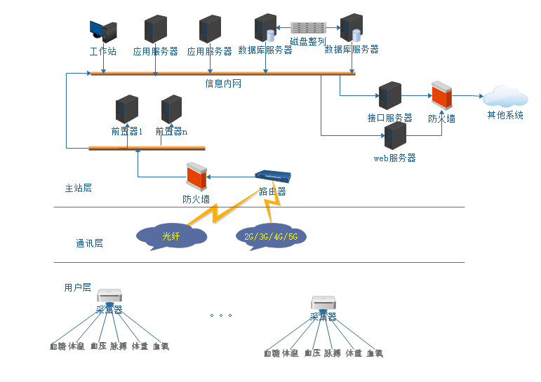

##### 社区健康与疫情监控系统

 
 

###### 可行性分析报告

 
 
 
 
 

###### 安徽中纳医疗信息技术公司

###### 2020 3 31

 
 
 
 

**文档修改历史**

|修改人|修改内容|修改日期|
|----|----|----|
|韩海舰|第一稿|2020.3.30|

**缩略语**

# 1 引言
## 1.1 项目背景  
　　2020年年初所发生的新冠疫情是对我国治理体系和能力的一次大考，党中央在此期间多次召开的会议上提出:"要改革和完善疾病预防控制体系，坚决贯彻预防为主的卫生和健康工作方针。要健全重大疫情应急响应机制，建立集中统一高效的领导指挥体系"。  
　　同时，根据2015年国务院发布《国务院办公厅关于推进分级诊疗制度建设的指导意见》，其中明确提出要建立以“基层首诊，双向转诊、急慢分治、上下联动”为内涵的分级诊疗制度;要加快推进医疗信息化建设，建立区域性医疗卫生信息平台，实现电子健康档案和电子病历连续记录以及不同级别、不同类别医疗机构之间的信息共享。  
　　为落实以上要求，必须加强完善社区居民健康信息收集，从而为分级诊疗提供数据支撑，为落实早发现、早报告、早治疗的疫情防控策略提供抓手，并为政府职能部门管理提供决策和分析依据。为此我们提出了要建立社区健康与疫情监控系统。

## 1.2 项目概述
　　"社区健康与疫情监控系统"(以下简称系统)，是一个面向社区居民，服务于社区基层，同时也为政府职能部门提供监测数据，并通过大数据分析，为其提供分析，决策依据的全国性大型信息系统。    
　　该系统以居民健康数据为中心，以居民健康服务和政府疫情监控为目标,将居民、社区、政府有机结合在一起。系统为社区居民建立电子病历，通过可穿戴式或医疗设备采集居民基础健康信息（如血压，体温等），尤其是对"老、慢、非"高风险人群进行监控。居民可通过手机App了解个人健康状况，及时发现健康隐患。健康数据通过光纤或5G传输网络汇总到职能部门数据中心，对于社区，通过此系统可及时了解居民健康状况，当出现异常时可及时进行处理；对于政府职能部门，通过此系统可进行大数据分析，发现疾病规律，进行流行病学分析。在疫情发生时，可有效进行疫情信息沟通，通过此平台及时发布权威准确信息，为政府落实政策提供有力抓手。  
　　同时，本系统也将与地区医疗系统、医保、新农合建立信息共享，居民在医院就诊时，上级医疗机构医生可全面了解患者平时健康状况；当居民在社区进行康复治疗时，社区医生也可了解患者在上级医疗机构的诊疗情况，从而为实现居民的双向转诊提供技术支撑。　　  
　　本系统的需方为政府职能部门,投资方包括政府,企业,开发维护方为企业,用户包括社区居民、社区居委会、政府职能部门。

## 1.3 文档概述
　　本文档将描述系统的总体要求，建设方案，实施方案，并从经济，技术，法律方面对该系统进行评估，从而判断项目的可行性。    
　　本文档属于商业秘密,其所涉及内容和资料仅限于相关方使用.在没有取得书面同意前,收件人不得将本文档全部或部分的予以复制、传播、泄露给他人。

# 2 建设模式 
## 2.1 系统建设目标
　　本系统为政府职能部门提供社区用户基础健康数据，推进社区医疗信息化建设，为分级诊疗,疫情防控提供数据支持，为居民健康提供基础服务。  

### 2.1.1采集对象
　　按照项目需求调研和功能设计要求，本系统要对所有社区居民的健康信息进行采集,尤其要对“老、慢、非”以及独居孤寡老人等高风险人群要进行重点健康监控。对于采集对象，按照户口所在地可分为外来务工人员，本地居民；按照年龄段可分为老中青人员。不同类型人员所要关注的健康数据有所不同，数据采集方式有可能不同。

### 2.1.2 采集数据
　　按照业务需求调研，本系统所采集的数据应尽可能关联常见疾病。数据的采集方式尽可能采用无创的方式,以有利于用户使用：

|数据名称|关联疾病|采集方式|
|----|-----------------------------------------|----------|
|血压|心血管，|无创血压仪|
|心跳|心血管，|无创血压仪|
|血糖|增高：各种糖尿病、慢性胰腺炎、心肌梗死、甲状腺功能亢进、肾上腺功能亢进、颅内出血; \
降低：常见于胰岛细胞瘤、糖代谢异常、严重肝病、垂体功能减退、肾上腺功能减退、甲状腺功能减退、长期营养不良、注射胰岛素过量|无创血糖仪|
|体温|各种炎症，呼吸系统疾病|体温计|
|血氧|心血管，|血氧仪|

　　以上数据为系统基础数据，根据医学统计可以覆盖70%种类疾病，针对特殊人群，系统还必须具有灵活的扩展能力，以支持多种健康数据采集。

### 2.1.3 业务和管理功能
　　按照业务需求调研,本系统应能为政府职能部门实现业务功能提供充分的信息保障,为其提供及时、完整、准确的基础数据，应能够支持以下业务和信息服务功能：

- 健康数据采集  
	实现居民健康数据的自动采集，以获得健康和疫情监控的全部数据。
- 健康诊疗：  
	为居民建立电子病历，居民在社区医院的就医信息纳入到信息系统中，为建立统一的医疗信息化平台提供数据。
- 异常报警：  
	对于居民而言，当健康数据出现异常时，可以通过手机app向个人发送告警信息，提示居民及时就医。  
	对于孤寡老人，或独自居住人员还应当有自动报警功能，当被监护人出现危及生命的体征状况时，可自动向系统发出报警信息，提示社区人员及时救治。
	对政府而言，通过对健康数据监控，当发现异常数据(如局部地区体温过高人数增多)时能够及时发出报警信息，提示管理人员进行及时处理。  
- 健康数据分析：  
	系统可对采集的数据进行综合分析，发现其中的规律信息，为政府职能部门分析提供工具。
- 疫情发布：  
	在疫情发生期间，系统可以为网上发布，短信平台，终端信息提示，app信息推送等方式及时发布权威，准确信息提供数据支持。
- 数据查询：  
	系统可为管理人员提供多种报表数据，为居民健康管理提供数据支持。  
	居民也可以通过手机app了解自身的健康状况。
- 数据开放服务  
	除了为政府职能部门提供居民健康管理服务之外，还可依据国家医疗信息系统的总体规划要求，设计数据接口，与医疗HIS，居民医保，新农合系统实现信息共享，方便居民挂号，报告查询，健康教育等。

　　现有的医疗信息系统主要包括公立医院的HIS系统,居民医保,新农合系统。在社区层面的医疗信息系统的比较薄弱，且未与公立医院信息系统联网[9 10 11 12]。本系统的创新点在于将居民，医院,社区,政府有机结合起来，形成信息共享平台，发挥信息整合优势；将居民健康与疫情监控结合起来，做到平战结合，为政府职能部门的管理提供了有力手段。  

## 2.2 主站建设模式
### 2.2.1 统一的信息采集
　　社区居民健康系统实现对所有社区居民的健康信息采集,包括城市用户,农村用户,用户面广量大.虽然用户对象年龄,身份不同,根据集约、统一、规范的要求，应当建立统一的健康信息采集平台，在一个平台上实现居民全覆盖。

### 2.2.2 主站系统的建设  
　　本系统将建成全国性的一个大型的居民基础健康信息系统，自动采集所有居民健康基础信息，实现居民健康异常报警，报表统计，健康诊疗等直接应用功能。除此之外在方案的设计中要考虑这些数据的综合应用，需要考虑与现有医疗系统的集成，与现有系统相互沟通，弥补原有系统在社区健康管理方面的空白。

### 2.2.3 应用部署模式
　　根据需求调查的结果，能够适合各个省市以及直辖市的系统应用部署模式有集中和分布两种形式。

### 2.2.3.1	部署方案
　　集中式部署是全省（直辖市）仅部署一套主站系统，一个统一的通信接入平台，直接采集全省范围内的所有居民信息，集中处理信息采集、数据存储和业务应用。下属的各地市机构不设立单独的主站，用户统一登录到省级主站，根据各自权限访问数据和执行本地区范围内的运行管理职能。集中部署主要适用于用户数量相对较少，地域面积不特别大，内部信息网络非常坚强的各个省以及直辖市。简称为集中采集，分布应用。  
　　分布式部署是在全省各地市分别部署一套主站系统，独立采集本地区范围内的居民信息，实现本地区信息采集、数据存储和业务应用。省从各地市抽取相关的数据，完成省的汇总统计和全省应用。分布部署主要适用于用户数量特别大，地域面积广阔，企业内部信息网络比较薄弱的省份。简称为分布采集，汇总应用。

### 2.2.3.2	方案选择
　　集中式部署和分布式部署的区别主要在于IT架构的不同，导致两个方案存在如下的差异。

1.	分布式式减少了对内部信息网的可靠性要求以及网络资源负担。 
2.	集中式部署时的故障影响范围涉及面较广。 
3.	集中式部署相对经济投资成本较低，运行维护统一。 

　　应用部署模式选择的主要依据是遵循业务应用系统的部署模式，社区居民健康信息采集本就是医疗信息应用系统的组成部分，将社区健康信息采集系统的主站部署和医疗业务应用一致起来，系统间的数据传输和运行维护均非常有利。    
　　在部署模式不能和医疗系统一致时，根据系统规模考虑。通常低于500万用户的宜采用全省集中主站部署，高于500万以上用户的可以考虑省市两级部署的应用模式。全省集中主站部署的主站数量不宜超过1000万的居民用户数量。 

## 2.3 信息采集模式
　　信息采集方式有两种:通过传感仪器自动釆集；居民在社区就医时所进行的询诊记录和检查记录。
     采用自动采集方式，操作应当尽量简单,以适合中老年人，减少其负担。采集装置包括：一个采集集中器，各类医疗传感器。采集器与各种传感器器之间通过无线方式连接(wifi.蓝牙等)。采集器定时采集室内人员信息，并记录保存。按照设置间隔(每时,每日)将健康信息上送到主站。采集器的设计应当是灵活的，可根据需要灵活的添加删除不同传感器信息.  
     人工采集方式，即居民在社区就诊时，将诊序记录和检查报告转换成统一的数据格式，以纳入统一的数据仓库中。
        
## 2.4 远程通信
　　远程通信是指采集器和系统主站之间的数据通信。通过远程通信，系统主站与用户侧的采集器间建立联系，下达指令和参数信息，收集居民健康信息。当前，数据传输的通信资源主要有以下三种：

1. 政府医疗部门自有的光纤专用通信网络。
2. 公共营运商提供的光纤传输网络；
3. 公共营运商提供的GPRS/CDMA虚拟专用无线数据传输网络；

下表是各种不同数传通信方式的比较：

表 3. 	远程信道分析比较

|传输方式|建设成本|通讯实时性|运行维护费|容量|可靠性|信息安全|
|----|----|----|----|----|-----|-----|
|专用以太光纤网络|高|满足要求|低|满足要求|满足要求|满足要求|
|公共以太光纤网络|低|低|低|满足要求|中|不满足要求|
|GPRS/CDMA|低|受第三方责任因素限制|高|基本满足要求|差|不满足要求|

确定信息采集系统数据传输通信信道的应用时应按以下优先原则进行：

1. 首先选择专用光纤网络；
2. 其次应用公共营运商提供的光纤网络；
3. 第三应用公共营运商提供的GPRS/CDMA通信技术，构建虚拟专用数传通信网络；

　　上述三种通信技术条件，均是当前建设信息采集系统的资源。在同一个地区，应该根据实际情况，有条件的前提下，按上述优选原则采纳其中一种或同时采纳两种、三种模式，综合利用，相互弥补，共同完成健康信息采集全覆盖的任务。

下面分别简要描述这三种通信模式主要的技术特性和应用规范。

### 2.4.1 专用光纤网络

　　光纤专网是指依据医疗信息系统建设总体规划而建设的以光纤为信道介质的一种医疗系统内部通信网络，覆盖全系统医疗机构.目前国内三甲医院基本具备骨干光纤通信，具备至1*2M或10M以太网接口，在此基础上具备向下延伸的网络基础。光纤专网旨在医疗通信网的基础上，向社区延伸，覆盖全部医疗机构，将高速以太网延伸至每个社区，形成光纤通信专网。业务流向为居民健康业务，即居民用户的健康信息统一接入，由上级医疗机构通信节点上传至系统主站。
 
图 6. 	光纤专网示意图

　　该通信网络的建设，将根本地解决了信息系统采集的远程数传通信的信道资源问题。据此，系统主站与采集现场建立了可靠的通信技术条件，满足信息采集系统集中采集和监控的需要，同时也为远程医疗提供通信基础保障。  
        光纤网络完整地覆盖整个医疗系统，在每一个社区卫生中心，卫生站提供以太接口方式的网络接口；   
      相对居民健康信息采集系统的数据传输需求而言，光纤通信专网提供了不受限的接入容量和高速的数传速率；光纤通信专网技术上不但通信稳定可靠，更重要的是属医疗系统自有的专用通信网络，不存在“第三方”的安全隐患。

### 2.4.2  公共光纤网络
　　与专用光纤网络类似，使用或租用公共运营商提供的光纤网络。在使用公共网络时，应充分考虑系统的安全性，可靠性。

### 2.4.2	公共无线网络
　　公共无线网络通信模式业内简称公网信道，它是相对于医疗系统自身建设的专用信道而言的，使用或租用公共通信运营商建设的公共通信资源，当前采集系统主要应用的是三大运营商提供的2/3/4/5G网络技术服务。 由于公网信道建设的初衷是为社会公众提供通信资源，信息采集系统使用公网信道时必须采用一系列的技术手段以满足自身需求，尤其应该在安全性、可靠性、实时性、可扩展性、经济性等诸方面着重考虑。 建议以省（直辖市）为单位，地市（区县）单位参与，统一与通信运营商协商进行技术与商务谈判争取最大的技术支持和最优惠的资费以满足下述各项要求。

# 3 系统架构
　　系统架构部分主要从系统逻辑架构、物理架构、应用部署方式、安全防护要求、系统指标要求等几方面，对信息采集系统的整体框架进行描述。从技术层面给出系统建设的总体架构和要求。

## 3.1 逻辑架构
　　系统逻辑架构主要从逻辑的角度对信息采集系统从主站、信道、终端、采集点等几个层面对系统进行逻辑分类，为下面各层次的设计提供理论基础。信息采集系统逻辑架构图如下：

逻辑架构图说明：

1. 本系统的相关方包括居民、社区医疗机构、社区管理部门、卫生主管部门。系统通过接口的方式，与医院HIS以及其它应用系统进行接口。
2. 主站层业务包括数据采集、分析预警、档案查询、社区医生诊疗、疫情发布几大部分。
3. 系统数据流向为通过采集模块或诊疗模块获得居民健康信息，并记录下来形成健康档案。通过分析模块对于信息进行判断，如果发现异常则产生报警信息提供给疾控中心等主管部门，由主管部门进行分析研判决定是否发布疫情通告，并通过疫情发布模块向社会发布疫情信息,通知社居委及时采取行动。在日常管理过程中，社居委和主管部门可通过查询模块生成各种报表数据已进行居民健康管理。

## 3.2 物理架构
　　系统物理架构是指信息采集系统实际的网络拓扑构成，从物理设备的部署层次和部署位置上给出形象直观的体现。信息采集系统物理架构图如下：

　　物理架构图说明：

1. 信息采集系统从物理上可根据部署位置分为主站、通信信道、采集设备三部分，其中系统主站部分建议单独组网，与其它应用系统以及公网信道采用防火墙进行安全隔离，保证系统的信息安全。有关系统安全的要求参见后面的系统安全防护章节。
2. 主站网络的物理结构主要由数据库服务器、磁盘阵列、应用服务器、前置服务器、接口服务器、工作站、GPS时钟、防火墙设备以及相关的网络设备组成，详细的设备说明和配置参见后面的硬件设计及典型配置章节。
3. 通信信道是指系统主站与终端之间的远程通信信道，主要包括光纤信道、GPRS/CDMA公用网络信道等。有关信道的组网情况和信道特点等参照后面的通信信道部分。
4. 采集设备是指安装在居民家中的采集器和医疗传感器。

## 3.3 安全防护
　　随着信息化水平的不断提高，信息化的应用环境也变得越来越复杂，信息系统所面临的安全隐患也越来越多，系统建设中需要建立一套切实有效的安全防护体系，保证系统的安全。下面从安全防护的总体要求、主站安全防护、终端安全防护、通信信道安全防护几个方面，对信息采集系统的总体安全防护加以说明。

### 3.3.1	总体要求
　　信息采集系统是医疗管理业务应用系统的基础数据源的提供者，为了确保系统的安全性和保密性，在指导思想上，首先应做到统一规划，全面考虑；其次，应积极采用各种先进技术，如虚拟交换网络、防火墙技术、加密技术、网络管理技术等，在系统的各个层面（操作系统、数据库系统、应用系统、网络系统等）加以防范；另外，在系统的日常运行管理中，要加强规范管理、严格安全管理制度。  
　　安全防护体系建设的总体目标：防止信息网络瘫痪、防止应用系统破坏、防止业务数据丢失、防止企业信息泄密、防止终端病毒感染、防止有害信息传播、防止恶意渗透攻击，以确保信息系统安全稳定运行，确保业务数据安全。 安全防护体系建设遵循以下策略：信息内外网间采用逻辑强隔离设备进行隔离；信息系统将以实现等级保护为基本出发点进行安全防护体系建设，并参照国家等级保护基本要求进行安全防护措施设计；信息系统划分为边界、网络、主机、应用四个层次进行安全防护设计，以实现层层递进，纵深防御。
		
### 3.3.2	边界安全防护
　　边界安全防护是指本系统与其它外系统间的边界网络接口的安全防护。网络管理员应当明确系统的网络边界，做好防护。主要的防护措施有：

- 域间访问控制：在不同的安全域之间对所交换的数据流进行访问控制，包括连接请求、通信流量、入侵检测等；
- 远程接入安全防护：对于远程访问，应当在信息边界采用认证加密等手段进行相应的安全防护；
- 对外服务安全：对通过边界提供给外系统的数据，要有相应的数据校验和审核机制，对数据的流出做好记录。 

### 3.3.3 网络环境安全防护
　　网络环境安全防护对系统中的组网方式、网络设备及经网络传输的业务信息流进行安全控制措施设计。  
　　组网方式设计是指选择安全可靠的基础网络和组网方式，是保证网络环境安全的基础，如通过公网网络时建立VPN等。  
　　网络设备设计是指为了保证网络环境的安全，增加相应的网络安全设备，如：路由器、交换机及防火墙、入侵检测设备、防病毒工具、安全认证芯片等。  
　　网络业务信息流包括各应用经由网络传输的业务信息，业务数据流在经由网络传输时可能被截获、篡改、删除，因此应当在网络层面采取安全措施以保证经由网络传输信息的安全。主要的措施有：  
　　入侵检测：对网络数据流进行入侵检测；  
　　数据传输加密：对经由网络传输的业务信息流，首先通过安全认证芯片进行加密处理，然后发送到网络上，接收端同样通过安全认证芯片进行解密认证。  

### 3.3.4 主站和安全防护
　　主机系统安全防护应当从操作系统安全、数据库安全几个层面进行防护。  
　　操作系统安全：选择安全可靠的操作系统；制定用户安全访问策略；限制管理员权限使用；及时升级操作系统安全补丁；安装第三方防病毒安全软件；做好数据备份。  
　　数据库安全：制定数据库用户认证机制和安全策略；对重要和敏感数据进行存储加密；及时升级数据库安全补丁；数据库系统做到双机热备，数据库的备份采用每天做增量备份、每周做全备份的方式进行备份，数据库的备份文件要考虑异机、异地的保存；对所有涉及安全的操作，要记录完整的操作日志；提供系统级和应用级完备的数据备份和恢复机制。  

### 3.3.5 业务应用安全防护
　　业务应用安全防护从应用系统安全防护、用户接口安全防护、数据接口安全防护三个层面进行描述。

建议：要增加对采集器的参数等方式进行防护

#### 3.3.5.1 应用系统安全防护
1. 建立严格的系统管理和操作的管理规章制度，确保系统操作的安全可靠。
2. 应用系统应定期做备份。
3. 建立严格的基于用户角色的权限管理和密码管理，对操作人员设定不同密码，并要求操作人员定期更换密码。
4. 开发测试系统与运行系统要严格分开。
5. 系统对所有改变系统参数、终端参数等操作的都要记录操作日志，记录所有受控操作发生的时间、对象、操作员、操作参数、操作机器IP地址等信息。对于敏感的控制操作要求IP地址绑定，并进行密码校验。

#### 3.3.5.2	数据接口安全防护
　　信息采集系统与其它系统间存在着大量业务数据需要共享，这些跨系统共享的数据极大支持了医疗应用的资源整合和业务决策，但同时也增加了数据暴露的风险。需要制定相应安全措施，以规范指导业务应用系统建设和运行的数据接口安全要求。从技术角度来看，认证和加密是保障数据接口安全的有效手段。  
　　对数据接口的安全防护分为域内数据接口安全防护和域间数据接口安全防护。域内数据接口是指数据交换发生在一个安全域的内部，由于不同应用系统之间需要通过网络共享数据，而设置的数据接口；域间数据接口是指发生在不同的安全域间，由于跨安全域的不同应用系统间需要共享数据而设置的数据接口。  
　　数据接口安全防护可考虑的安全措施：接口数据连接建立之前进行接口认证，认证方式可采用共享口令、用户名／口令等方式，并对口令长度、复杂度、生存周期等进行强制要求，在认证过程中所经网络传输的口令信息应当禁止明文传送，可通过哈希（HASH）单向运算、SSL加密、SSH加密等方式实现，也可通过专用的安全认证芯片来实现。

## 3.4	系统指标
### 3.4.1	系统响应速度
1. 主站巡检终端重要信息（重要状态信息）时间<15min；
2. 系统控制操作响应时间（遥控命令下达至终端响应的时间）≤5s；
3. 常规数据召测和设置响应时间（指主站发送召测命令到主站显示数据的时间）＜15s；
4. 历史数据召测响应时间（指主站发送召测命令到主站显示数据的时间）＜30s；
5. 系统对客户侧事件的响应时间≤30min；
6. 常规数据查询响应时间＜10s；
7. 模糊查询响应时间＜15s；
8. 90%界面切换响应时间≤3s,其余≤5s；
9. 前置主备通道自动切换时间＜5s；
10. 在线热备用双机自动切换及功能恢复的时间＜30s；
11. 计算机远程网络通信中实时数据传送时间＜5s。

###　3.4.2	系统可靠性指标
1. 主站年可用率≥99.5%；
2. 主站各类设备的平均无故障时间（MTBF）≥4´104h小时；
3. 系统故障恢复时间≤2h；
4. 由于偶发性故障而发生自动热启动的平均次数应＜1次/3600h。

### 3.4.3系统数据采集成功率
　　系统数据采集成功率分一次采集成功率和周期采集成功率，均指非设备故障和非通信故障条件下的统计。

1. 一次采集成功率：≥95%；
2. 周期采集成功率：≥99.5%，周期为1天，日冻结数据。

### 3.4.4主站设备负荷率及容量指标
1. 在任意30分钟内，各服务器CPU的平均负荷率≤35%；
2. 在任意30分钟内，人机工作站CPU的平均负荷率≤35%；
3. 在任意30分钟内，主站局域网的平均负荷率≤35%；
4. 系统数据在线存储≥3年。

### 3.4.5	主站运行环境
　　主站计算机机房的环境条件应符合GB/T 2887-2000的规定。  
　　主站应有互为备用的两路电源供电。必须配备UPS电源，在主电源供电异常时，应保证主站设备不间断工作不低于2h。

# 4 实施方案
## 4.1 主站配置方案
　　本部分首先提出了主站规模的评价标准，然后根据主站规模，把系统分为小型、中小型、中型、大中型、大型、超大型六个档次，并设计了各档次的典型配置方案。各单位可参照系统规模典型配置，根据自身条件进行适当的增加和剪裁。

### 4.1.1主站规模评价标准
　　主站规模的评价标准从两方面进行评估：数据影响量和工作站并发数。在进行规模评估时，也要适当考虑到系统的扩展性、用户数增加频度、系统资源消耗等。

#### 4.1.1.1数据影响量评估
　　接入主站系统的终端数量及其数据量是影响主站设计规模的一个重要因素，合理地对数据影响量进行评估，会直接指导系统的建设。健康信息采集系统的终端类型有多种，各种类型终端对应采集不同的电力用户，所采集的数据项、频度不一致，导致综合数据量不同，对主站的数据处理性能要求也不同。为了能够比较客观、合理地评估数据影响量，本典型方案假定以一个居民用户作为数据影响量评估的基准，用户数据采集的标准为采集实时数据、日数据、月数据和曲线数据。每个小区采集数据量以200个居民为准。

### 4.1.1.2	主站规模的选择
　　根据数据影响量和工作站并发数对系统规模进行评估，将系统的规模划分为六大类，典型配置方案下面的章节将按照不同类型分别设计主站硬件配置、系统软件配置、应用软件配置。系统主站规模分类如下：

表 3. 	主站规模分类表

|序号|系统类别|居民用户数（万户）|工作站并发数（个）|
|----|----|----|----|
|1|小型系统|<20|20以下|
|2|中小型系统|20～40|50以下|
|3|中型系统|40～100|100以下|
|4|大中型系统|100～200|200以下|
|5|大型系统|200～500|400以下|
|6|超大型系统|500～1000|700以下|

### 4.1.2小型系统典型配置
　　小型信息采集系统典型配置适合居民用户数小于20万户，工作站并发数小于20个的系统，下面是小型系统的典型配置。

#### 4.1.2.1主站硬件配置

表 4. 	小型系统主站硬件配置表

|序号|名称|配置要求|数量|
|----|----|----|----|
|1|	数据库服务器\
CPU\*2或2核心\
4G内存\
千兆以太网卡\*2\
73G硬盘\*2\
电源模块\*2\
光纤阵列卡\*2|机架式PC Server或小型机：|2|
|2|磁盘阵列\
146G硬盘\*5\
电源模块\*2\
光纤端口\*2\
光纤交换机\*2|磁盘阵列：|1|
|3|前置服务器\
CPU\*1、主频3.0GHz\
2G内存\
千兆以太网卡\*2\
73G硬盘\*2\
电源模块\*|机架式PC Server：2|2|
|4|应用服务器（含Web服务器）\
CPU\*2或2核心\
4G内存\
千兆以太网卡\*2\
73G硬盘\*2\
电源模块\*2|机架式PC Server或小型机：|1|
|5|接口服务器\
CPU\*2或2核心\
2G内存\
千兆以太网卡\*2\
73G硬盘\*2\
电源模块\*2|机架式PC Server：|1|
6|维护、监控工作站\
CPU\*1、主频3.0GHz\
内存：1G\
网卡：百兆以太网卡\
硬盘：80G	3\*（地市数量+1）|品牌PC：|
|7|主网络交换机|千兆三层以太网交换机：\
12端口RJ45接口|1|
|8|通信网络交换机|百兆以太网交换机|1|
|9|地市子网交换机|百兆以太网交换机|地市数量|
|10|防火墙（系统接口、公网接入）|硬件防火墙|2|
|11|GPS时钟||1|
|12|机柜（含切换器、液晶显示器、鼠标、键盘等）||2|
|13|备份服务器|机架式PC Server：\
CPU\*2或2核心\
2G内存\
千兆以太网卡\*2\
73G硬盘\*2\
电源模块\*2|1|
|14|磁带库|500G|1|

#### 4.1.2.2	系统软件配置
表 5. 	小型系统系统软件配置表

|序号|名称|分类|配置要求|数量|
|----|----|-----|------------|-----------|
|1|操作系统|数据库服务器|Unix或Windows服务器操作系统(具体型号和版本根据数据库服务器配置)|2|
|2|操作系统|前置服务器|Unix或Windows服务器操作系统(具体型号和版本根据数据库服务器配置)|2|
|3|操作系统|应用服务器|Unix或Windows 服务器操作系统(具体型号和版本根据数据库服务器配置)|1|
|4|操作系统|接口服务器|Windows 服务器操作系统|1|
|5|操作系统|备份服务器|Windows 服务器操作系统|1|
|6|操作系统|工作站|Windows工作站操作系统(如Windows 2000/XP/Vista等)|每工作站1套
|7|数据库管理系统||Oracle、Sybase、DB2等大中型商用数据库管理系统中选择其一|1套（4CPU授权、支持集群）|
|8|应用服务器平台||WebLogic、\
WebSphere、\
OracleAS、\
JBOSS、\
Tomcat、\
Windows .NET等选择其一|1套（2CPU授权）|

#### 4.1.2.3	应用软件配置
表 6. 	小型系统应用软件配置表

|序号|名称|分类|配置要求|数量|
|----|----|----|----|----|
|1|信息采集系统主站软件|所有应用功能|必选|1|

## 4.2 用户配置

## 4.3典型应用方案
　　在工程实践中，由于现实情况的复杂，信息采集系统的远程信道选择、用户采集终端模式的选择，将呈现出多种模式的复合。这里为了更好的评估系统投资，根据上文中提出的技术方案，这里给出六种典型省（直辖市）的信息采集系统建设方案。

### 4.2.1	典型应用方案一

|名称|模 式 描 述|
|----|----------------------------------------------|
|主站	|集中式主站|
|远程信道|	光纤专网（无线公网/光纤公网）|
|终端类型|	大型专变用户	FKXA4专变终端\
	中小型专变用户	FKXB4专变终端\
	低压三相一般工商业用户	集中器（宽带载波）＋采集器＋RS-485电能表\
（注：公变下三相多功能表计量用户，可以考虑采用远程多功能电能表）\
	低压单相一般工商业用户	\
	居民	\
	公变计量点	集中器RS-485直接采集台区总表|

　　方案采用集中式部署的大型数据采集主站系统，远程信道选择光纤专网，光纤公网和无线公网作为补充。系统同时管理多种通讯信道，接入信息采集终端，自动采集所有用户的健康信息，实现居民健康预警，数据分析功能。

　　全省（直辖市）仅部署一套主站系统，一个统一的通信接入平台，直接采集全省范围内的所有现场终端和表计，集中处理信息采集、数据存储和业务应用。下属的各地市公司不设立单独的主站，用户统一登录到省公司主站，根据各自权限访问数据和执行本地区范围内的运行管理职能。
现场终端类型配置：

1. 大型专变用户采用FKXA4专变终端，该终端可用于专变大用户用电现场的有序用电管理和实时负荷监测，具备控制模块，RS-485本地通信采集电表数据，两轮功率控制和紧急限电管理的辅助手段，终端具备预付费管理功能。  
2. 中小型专变用户选择FKXB4专变终端，该终端适用于中小型专变用户的用电管理，RS-485本地通信采集电表数据，具备预付费管理和计量异常事件管理等功能。  
3. 公变下的低压单相一般工商业、低压三相一般工商业以及居民用户采用“集中器＋采集器＋RS-485电能表”，本地通讯采用宽带载波方式。  
4. 公变台区总表用集中器RS-485直接采集。  
5. 对管理要求较高的装用多功能表的低压三相一般工商业用户，可以采用远程多功能电能表，以加强单个用户用电信息采集和监控能力。  
该方案适用于居民用户数小于1000万户的网省公司以及直辖市公司，地域面积不特别大，企业内部信息网络非常坚强。主站根据用户数选择大型或超大型典型配置，工作站并发数小于700个。
宽带集中抄表终端+RS-485电表的模式适用于城区供电、表箱集中布置的地区，不需要对有RS-485接口的电表进行更换。不同之处：宽带载波通讯采用IP网络技术，永久在线，能够对全面远程控制对复杂业务提供较好支持，但对分散用户需要配置单独的采集器或远程网络电表加以补充，对供电半径过大的配变台区需要采用窄带载波方案补充。集抄用户以配变台区集中，采集装置和计量装置分离，接口规范，易于分专业管理和施工，但对公变下的供电半径有要求，维护工作量相对便大。

## 4.3 安装施工
### 4.3.1 原则及范围
#### 4.3.1.1 适用范围
本章节主要描述方案中第六章提出的集抄终端设备的安装调试规范。

#### 4.3.1.2 主要原则
2.1.3	实现目标

### 4.3.2 施工准备
2.2.1	制定计划
2.2.2	现场勘察
2.2.3	方案设计
2.2.4	物料准备

### 4.3.3 施工措施
#### 4.3.3.1 安全措施
现场被施工设备的停送电均由专人负责。
1.	被施工设备停电时，必须切除该设备内可能带电的部位，并在验明无电后方可工作；
2.	现场如有无法切除的带电设备，应在该设备上悬挂标示牌，施工区域应安放临时遮拦；
3.	送电时，必须先把设备检查一遍确定没有短路、错误接线后方可送电。

#### 4.3.3.2 组织措施

#### 4.3.3.3 技术措施
安装终端时需将电表箱停电，步骤措施如下：
2.3.3.1	停电措施
1.	首先断开要施工的电表箱内进线三相总电源空气开关；
2.	然后断开所有用户小空开以防反送电。
2.3.3.2	验电措施

### 4.3.4 安装调试
2.4.1	设备安装
根据台区类型不同应遵循以下原则进行设备安装和调试：
2.4.1.1	集中器设备安装：
2.4.1.2	采集器设备安装:

### 4.3.5 验收

2.5.1	验收流程
为确保工程质量达到要求，设备从安装前到工程结束，依据施工的进度和规模程度，分三阶段组织验收，具体包括：施工前验收、工程验收、实用化验收等过程。
2.5.1.1	施工前验收
施工前验收主要包括出厂验收、到货验收、设备检验。
1.	出厂验收：根据技术条件要求，生产厂家组织自验收并向供应单位提供产品检测的证明材料、合格证等。
2.	到货验收：设备送到供电公司后由负责部门组织人员按技术条件的要求验收，主要包括型号、数量、以及外观标识等。
3.	设备检验：供电公司验收部门根据技术标准对供应的设备按技术条件进行设备检测，合格品予以安装使用。
2.5.1.2	工程验收
2.5.2	验收的内容
验收的内容具体包括工程质量、功能、指标等三个方面。
2.5.2.1	工程质量验收：
1.	检查设备安装位置是否合理，电源线接法是否符合工艺要求：
2.	终端应直接安装在电表箱内的空表位上，如没有空表位终端可摆放在表箱底部或其他合适位置；
3.	终端的安装位置应避免影响其它设备的操作；
4.	集中器可安装在三相电源开关箱边；
5.	集中器安装高度不得低于1.7米；
6.	检查信号采集线的布线是否规范，接线是否符合工艺：
7.	接头要求接触紧密，接触电阻小，稳定，可靠；
8.	接头的绝缘强度应与导线的绝缘强度一致；
9.	对于中间连接的信号线或电源线应用绝缘包带进行包扎不得裸露，以保证导线的绝缘强度。
10.	工程文件的验收：主要包括设备清单、终端与表计或集中器与载波表对应关系表、系统结构图、设备安装图等。
2.5.2.2	 功能验收
2.5.2.3	验收的指标

包括处理流程，数据流程，物理设备，运行环境，经费，创新点以及新系统的局限性。

# 5. 经济可行性
包括投资，收益，回收周期，市场预测

# 6. 技术可行性
论证企业现有资源是否满足实施要求，人员设备，资金。

# 7.  法律可行性
论证系统是否符合法律法规，是否有侵权违法责任。

# 8. 用户可行性
从用户角度说明解决法案可行性，包括用户单位的行政管理和工作制度，使用人员的素质和培训要求。

# 9 其他与项目有关的问题
未来可能的变化

# 参考文献  
[1] 习近平2020年2月3日在中央政治局研究应对新型冠状病毒肺炎疫情工作时的讲话  
[2] 习近平2020年2月14日在中央全面深化改革委员会第十二次会议讲话  
[3] 习近平2020年2月23日在统筹推进新冠肺炎疫情防控和经济社会发展工作部署会议上讲话  
[4] 国务院办公厅关于推进分级诊疗制度建设的指导意见，2015  
[5] 张杨，陈真诚，朱健铭，徐彪 一种改进的能量代谢守恒法无创检测血糖算法 , 2016年6期《传感技术学报》   
[6] 大数据基础上的社区医疗服务平台构建  
[7] 基于可穿戴设备的社区医疗监护系统  
[8] 京津冀地区老年人社区医疗护理服务需求现状及影响因素调查  
[9] 南京市鼓楼区社区医疗卫生服务设施配套规划研究  
[10] 区域医疗信息系统研究综述  
[11] 社区医疗远程诊断系统的设计与实现  
[12] 香港社区医疗管理体制的特点及启示  
