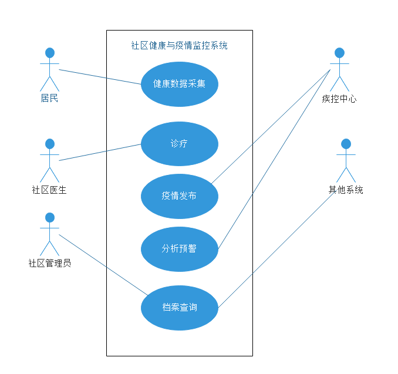
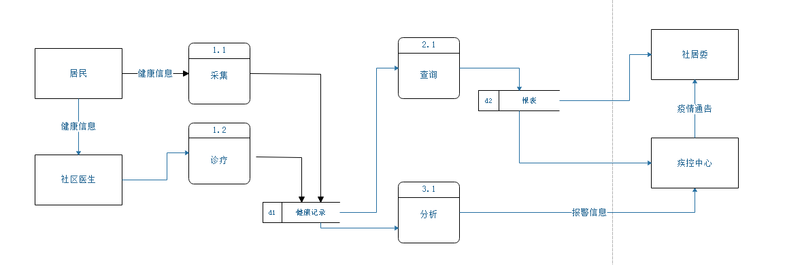
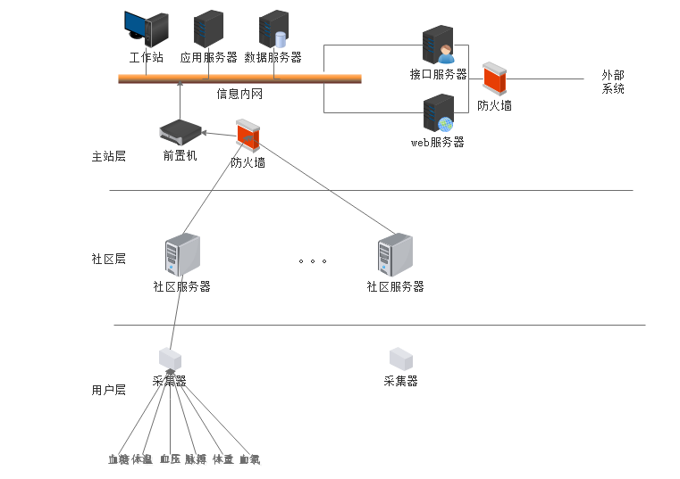

#####社区健康与疫情监控系统可行性分析报告
产品名称:

产品版本

修改历史

|修改人|修改内容|修改日期|
|----|----|----|
|a|b|c|

缩略语

# 1 引言
## 1.1 项目背景  
　　2020年年初所发生的新冠疫情是对我国治理体系和能力的一次大考，党中央在此期间多次召开的会议上提出:"要改革和完善疾病预防控制体系，坚决贯彻预防为主的卫生和健康工作方针。要健全重大疫情应急响应机制，建立集中统一高效的领导指挥体系"。  
　　同时，根据2015年国务院发布《国务院办公厅关于推进分级诊疗制度建设的指导意见》，其中明确提出要建立以“基层首诊，双向转诊、急慢分治、上下联动”为内涵的分级诊疗制度;要加快推进医疗信息化建设，建立区域性医疗卫生信息平台，实现电子健康档案和电子病历连续记录以及不同级别、不同类别医疗机构之间的信息共享。  
　　为落实以上要求，必须加强完善社区居民健康信息收集，从而为分级诊疗提供数据支撑，落实疫情防控早发现，早报告的防控策略，并为政府部门提供决策数据和依据。为此我们提出了建立社区健康与疫情监控系统。

## 1.2 项目概述
　　"社区健康与疫情监控系统"(以下简称系统)，是一个面向社区居民，服务于社区基层，同时也为政府健康职能部门提供监测数据，通过人工智能，大数据分析，为管理部门提供分析，决策依据的信息系统。    
　　该系统为社区居民建档立卡，收集居民基础健康信息（如血压，体温等），尤其是"老、慢、非"，独居的孤寡老人等高风险人群的健康信息。社区部门通过此系统可以及时掌握本区居民健康状况。除此之外，该系统还将汇总各个社区的居民健康信息提供给政府相关职能部门(如疾控中心，卫健委)，进行人工智能分析、大数据研判，从而可以及时发现疫情隐患，提早布防。同时，在疫情发生情况下，也可通过此平台及时发布权威准确信息，为政府落实政策提供有力抓手。  
　　本系统的需方为政府职能部门,投资方包括政府,企业,开发维护方为企业,用户包括社区居民、社区居委会、政府职能部门。

## 1.3 文档概述
　　本文档将描述系统的总体要求，建设方案，实施方案，并从经济，技术，法律方面对该系统进行评估，从而判断项目的可行性。    
　　本文档属于商业秘密,其所涉及内容和资料仅限于相关方使用.在没有取得书面同意前,收件人不得将本文档全部或部分的予以复制、传播、泄露给他人。

# 2 建设模式 
## 2.1 系统建设目标
　　本系统建设是为政府职能部门提供社区用户基础健康数据，推进医疗信息化建设，为分级诊疗,疫情防控提供数据支持，为更好的服务居民健康提供技术基础。  
　　按照项目需求调研和功能设计的要求,健康和疫情监控系统要对社区用户健康数据全面采集,满足政府职能部门,社区管理部门的各种业务要求。

### 2.1.1采集对象
　　按照项目需求调研和功能设计要求，本系统要对所有社区居民的健康信息进行采集。对于社区而言，按照户口所在地可分为外来务工人员，本地居民；按照年龄段可分为老中青人员,不同类型人员所要关注的健康数据有所不同，尤其对“老、慢、非”以及独居孤寡老人等高风险人群要进行重点健康监控。

### 2.1.2 采集数据
　　按照业务需求调研，本系统应能采集如下数据：

|数据名称|关联疾病|采集方式|
|----|-----------------------------------------|----------|
|血压|心血管，|无创血压仪|
|心跳|心血管，|无创血压仪|
|血糖|增高：各种糖尿病、慢性胰腺炎、心肌梗死、甲状腺功能亢进、肾上腺功能亢进、颅内出血;降低：常见于胰岛细胞瘤、糖代谢异常、严重肝病、垂体功能减退、肾上腺功能减退、甲状腺功能减退、长期营养不良、注射胰岛素过量|无创血糖仪|
|体温|各种炎症，|体温计|
|血氧|心血管，|血氧仪|

　　以上数据为系统基础数据，根据医学统计可以覆盖70%种类疾病，针对特殊人群，系统还必须具有灵活的扩展能力，可以支持多种健康数据采集。

### 2.1.3 业务和管理功能
　　按照业务需求调研,本系统应能为政府职能部门实现业务功能提供充分的信息保障,为职能部门业务职责提供及时、完整、准确的基础数据，能够支持以下业务和信息服务功能：

- 健康数据采集
- 健康诊疗：
- 异常报警：
- 健康数据分析：
- 疫情发布：
- 数据查询：

描述采集对象,采集数据,业务支持和管理功能.可以简略提及现有系统的状况,指出其局限性,并提出本系统的创新点.
　　本系统的创新点在于将居民平时健康管理与战时的疫情防控有机结合，做到了平战结合的要求，为政府职能部门的精细化管理提供了有力手段。  

## 2.2 主站建设模式
描述主站的部署方式,与其他系统的关系

## 2.3 信息采集模式
描述信息采集过程

## 2.4 通信模式
描述系统中的通信方式

# 3 系统架构

## 3.1 业务模型

## 3.2 物理架构

## 3.3 安全防护

# 4 实施方案

## 4.1 应用方案

## 4.2 安装维护
包括处理流程，数据流程，物理设备，运行环境，经费，创新点以及新系统的局限性。

# 5. 经济可行性
包括投资，收益，回收周期，市场预测

# 6. 技术可行性
论证企业现有资源是否满足实施要求，人员设备，资金。

# 7.  法律可行性
论证系统是否符合法律法规，是否有侵权违法责任。

# 8. 用户可行性
从用户角度说明解决法案可行性，包括用户单位的行政管理和工作制度，使用人员的素质和培训要求。

# 9 其他与项目有关的问题
未来可能的变化

# 参考文献  
[1] 习近平2020年2月3日在中央政治局研究应对新型冠状病毒肺炎疫情工作时的讲话  
[2] 习近平2020年2月14日在中央全面深化改革委员会第十二次会议讲话  
[3] 习近平2020年2月23日在统筹推进新冠肺炎疫情防控和经济社会发展工作部署会议上讲话  
[4] 国务院办公厅关于推进分级诊疗制度建设的指导意见，2015  
[5] 张杨，陈真诚，朱健铭，徐彪 一种改进的能量代谢守恒法无创检测血糖算法 , 2016年6期《传感技术学报》 

